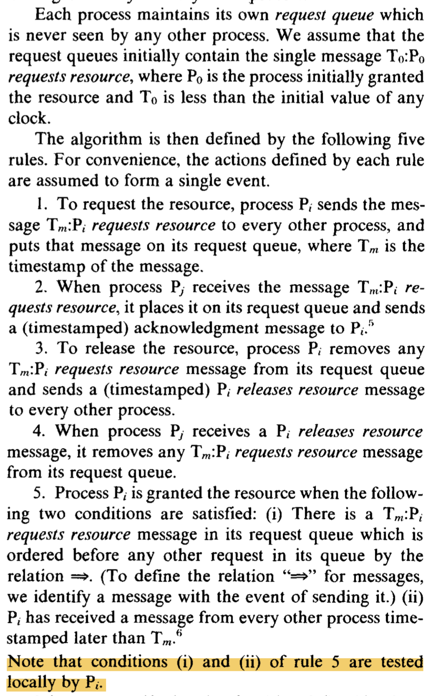

# CS739 - Week3 Note (9/21, F)


## Questions

1. Define "happens before"; give 2 events in a distrivuted system does one happen before the other?
2. What does it mean for two events to be "concurrent"?
3. What are Lamport's clocks; how do they work on message send and receive? What is the clock condition?
4. How can a total order be established among clocks? Why might this be useful?
5. Describe the mutual exclusion algorithm in Lamport paper. How does it work? Under what assumptions?
6. Describe vector clocks and how they work; what additional properties do they give you beyond Lamport clocks?
7. What are the downsides of using vector clocks instaead of Lamport clocks?
8. Whati s. aconsistent cut, and how might it be useful?


```
Fundamental of the distributed system - clock
Two ocean compress into a class...
```


13:39

**Time is difficult to think of in concurrent world.**

## About the author

**Lamport**: https://amturing.acm.org/award_winners/lamport_1205376.cfm

LaTeX

> *If we could travel back in time to 1974, perhaps we would have found Leslie Lamport at his busy local neighborhood bakery, grappling with the following issue. The bakery had several cashiers, but if more than one person approached a single cashier at the same time, that cashier would try to talk to all of them at once and become confused. Lamport realized that there needed to be some way to guarantee that people approached cashiers one at a time.* *This problem reminded Lamport of an issue which has been posed in an earlier article by computer scientist Edsger Dijkstra on another mundane issue: how to share dinner utensils around a dining table. One of the coordination challenges was to guarantee that each utensil was used by at most one diner at a time, which came to be generalized as the \**mutual exclusion** problem, exactly the challenge Lamport faced at the bakery.*

> **3. Foundations of Distributed Systems**
>
> **Logical clocks:** Many people realized that a global notion of time is not natural for a distributed system.  Lamport was the first to make precise an alternative notion of "logical clocks", which impose a partial order on events based on the causal relation induced by sending messages from one part of the system to another [[9](https://amturing.acm.org/bib/lamport_1205376.cfm#bib_9)]. His paper on "Time, Clocks, and the Ordering of Events in a Distributed System" has become the most cited of Lamport’s works, and in computer science parlance logical clocks are often nicknamed *Lamport timestamps*. His paper won the 2000 *Principles of Distributed Computing Conference* Influential Paper Award (later renamed the Edsger W. Dijkstra Prize in Distributed Computing), and it won an ACM SIGOPS Hall of Fame Award in 2007.
>
> To understand why that work has become so influential, recognize that at the time of the invention there was no good way to capture the communication delay in distributed systems except by using real time. Lamport realized that the communication delay made those systems very different from a shared-memory multiprocessor system. The insight came when reading a paper on replicated databases [[10](https://amturing.acm.org/bib/lamport_1205376.cfm#bib_10)] and realizing that its logical ordering of commands might violate causality.


What we will talk about in the future:

How to build a reliable, replicated system

primary back-up

replicated state machine


## Talk about these questions

#### Define "happens before" in distributed systems

#### What do we know about the order?
We don't know: how long a message sending will take.
We only know: message is sent before received.
=> connect events with a [POSET](https://en.wikipedia.org/wiki/Partially_ordered_set)

In Lamport 1978: 
#### Define  "Concurrent" => $\neg ( i < j ) \or \neg ( j < i)$

#### How to you follow the rules of the sender and receiver?

#### Clock Conditions

#### How to establish a total order?
Naturally, break tie: additional information like process id, etc.

#### How mutual exclusion works?

As long as we maintain a queue, everyone is not down, then we all know what's the order of resource acquirement.

##### Unrealistic Assumption:

- Failure? Membership? 


[P561]




#### Defict in Lamport's system: causality is lost

How to define a more general notion of the distributed system clock?

Mattern, 1989


### 6. What are the downsides of using vector clocks instaead of Lamport clocks?

- Scale: It assumes that every process knows each other --- the entities are fixed. In reality: process come, process go, and machine up and down all the time. How should we keep track that? **=> a scale problem of the system**
- Trust boundary: how should I deal with maliciousness?
- Recovery: how do I know my time when I'm up? 

=> [Bayzentine faliure](https://en.wikipedia.org/wiki/Byzantine_fault_tolerance): when machines are 


How the vector clock get around without communication?

(I personally think that either clocks are not bypassing the communication process. Clock ticks depends on a natural tick and a send/recv update).

[Google spanner](https://cloud.google.com/spanner/): true-time -- as long as the clocks are sync to some degree. (I havn't understnad...)


### Core question: Concensus. 
**i.e., How do we agree on something?**

#### Two general problems

[Two general problem](https://en.wikipedia.org/wiki/Two_Generals%27_Problem): (related to TCP 3 handshakes?)


### 7. What is a consistent cut, and how might it be useful?

Q1: If processes never communicate, is it hard to make a consistent cut?

A1: Very simple -- any cut can be a consistent cut. There is no message connecting between them, therefore no causality relations between.

Useful: Design some distributed algorithm

- Snapshot
- Distributed Debugging