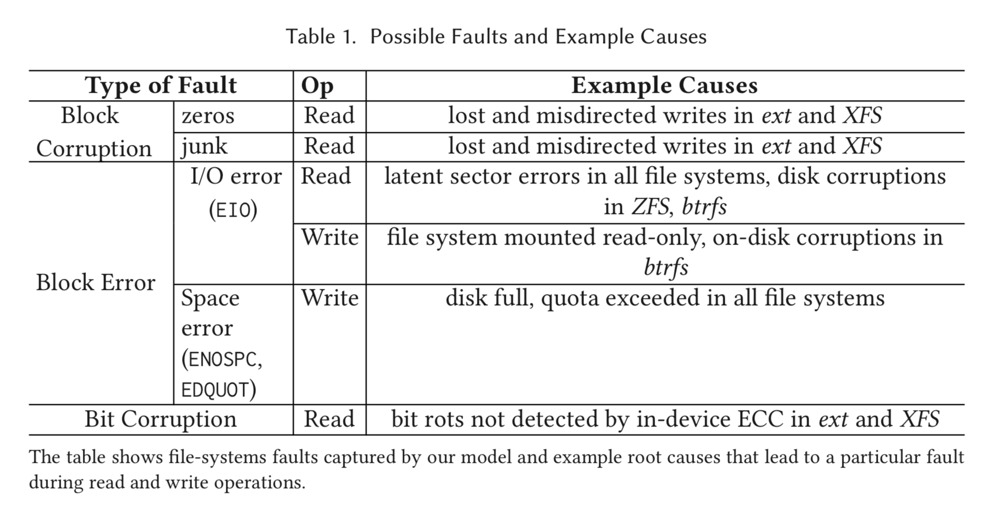
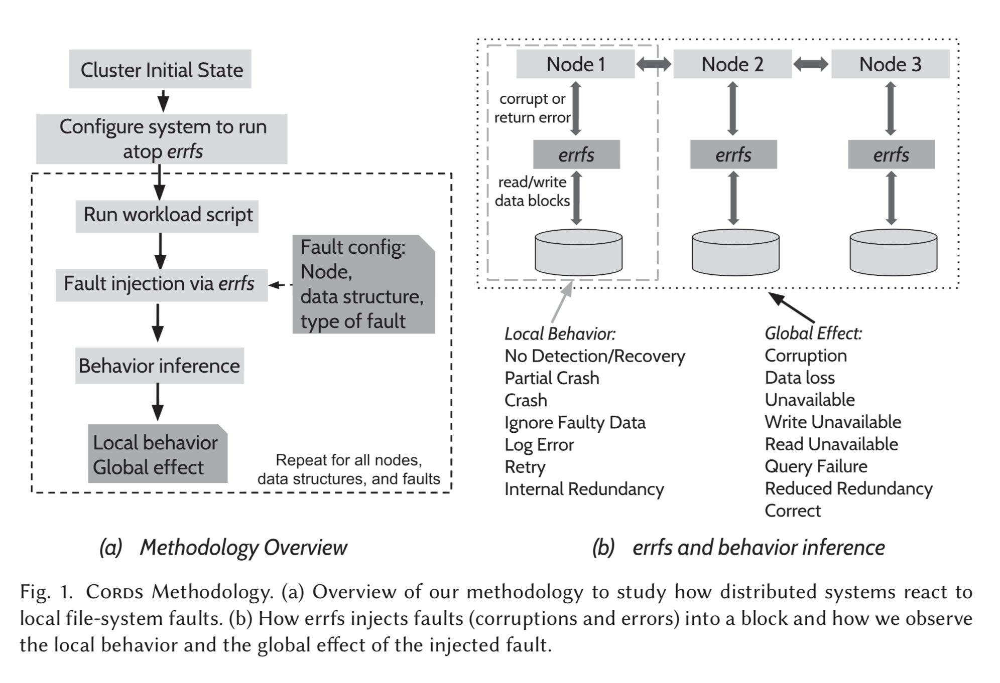

# Project2 Cord Note

Redundancy Does Not Imply Fault Tolerance: Analysis of Distributed Storage Reactions to File-System Faults

2017, AISHWARYA GANESAN, RAMNATTHAN ALAGAPPAN, ANDREA C. ARPACI-DUSSEAU, and REMZI H. ARPACI-DUSSEAU

# Summary

## Main Questions

1. How do modern distributed storage systems behave in the presence of local file-system faults? 
2. Do they use redundancy to recover from a single file-system fault?

## Lesson

> The most important overarching lesson from our study is this: **A single file-system fault can induce catastrophic outcomes in most modern distributed storage systems**. Despite the presence
> of checksums, redundancy, and other resiliency methods prevalent in distributed storage, a single file-system fault can lead to data loss, corruption, unavailability, and, in some cases, the spread of corruption to other intact replicas.

Observation: **pass-as-is** is the most common way for FS to deal with underlying layer fault.

## Methodology

1. Inject zeros, junks
2. Throw errors

# Detail

## 1 Introduction

Types of storage

- Key-value store (Redis)
- Configuration store (ZooKeeper, LogCabin)
- Document stores (MongoDB)
- Column stores (Cassandra)
- Messaging queues (Kafka)
- Database (RethinkDB, CockroachDB)

**Partial Storage Fail**

> Unfortunately, storage devices such as disks and flash drives exhibit a more complex failure model in which **certain blocks of data can become inaccessible (read and write errors) [7, 9, 49, 55, 80, 82] or, worse, data can be silently corrupted [8, 60, 86]**. These complex failures are known as partial storage faults [63].

File System Fault

> File systems, in some cases, simply propagate the faults as-is to applications; 
>
> for example, <u>ext4 returns corrupted data as-is to applications if the underlying device block is corrupted</u>. 
>
>
>
> In other cases, file systems react to the fault and transform it into a different one before passing onto applications; 
>
> for example, <u>btrfs transforms an underlying block corruption into a read error.</u> 
>
>
>
> In either case, we refer to the faults thrown by the file system to its applications as file-system faults.

**CORDS**

1. **errfs**: a user-level FUSE file system that systematically injects file-system faults
2. **Err-bench**: a suite of system-specific workloads that drives systems to interact with their local storage

**Lesson**

> The most important overarching lesson from our study is this: A single file-system fault can induce catastrophic outcomes in most modern distributed storage systems. Despite the presence
> of checksums, redundancy, and other resiliency methods prevalent in distributed storage, a single file-system fault can lead to data loss, corruption, unavailability, and, in some cases, the spread of corruption to other intact replicas.

**Observation**

1. Sometimes fs's right, sometimes fs's wrong

> **Systems employ diverse data-integrity strategies.** We find that systems employ diverse strate- gies to protect against file-system faults; while some systems carefully use checksums, others com- pletely trust lower layers in the stack to detect and handle corruption. 
>
>
>
> **Faults are often undetected locally.** We find that faults are often locally undetected. Sometimes, such locally undetected faults lead to immediate harmful global effects. 
>
>
>
> **Crashing is the most common reaction.** Even when systems reliably detect faults, in most cases, they simply crash instead of using redundancy to recover from the fault. 
>
> Redundancy is underutilized. Although distributed storage systems replicate data and func- tionality across many nodes, a single file-system fault on a single node can result in harmful clus- terwide effects; surprisingly, many distributed storage systems do not consistently use redundancy as a source of recovery. 
>
>
>
> **Crash and corruption handling are entangled.** Systems often conflate recovering from a crash with recovering from corruption, accidentally invoking the wrong recovery subsystem to handle the fault, and ultimately leading to poor outcomes such as data loss. 
>
>
>
> **Local fault handling and global protocols interact in unsafe ways.** Local fault-handling behaviors and global distributed protocols, such as read repair, leader election, and re- synchronization, sometimes interact in an unsafe manner, leading to propagation of corruption to intact replicas or data loss. 

## 2 Background and Motivation

**Question**

1. Why applications running atop file systems can encounter faults
   during operations such as read and write?
2. Why such file-system faults are important in the context of distributed storage systems and the necessity of end-to-end data integrity and error handling for these systems?

### 2.1 File-System Faults

**Block errors** where certain blocks are inaccessible (also called latent sector errors).

> File systems can observe block errors when the disk returns an **explicit error** on detecting some problem with the block being accessed.

**Block corruptions**, where certain blocks do not contain the expected data.

> File systems can receive corrupted data due to **a misdirected or a lost write caused by bugs in drive firmware** [8, 60] or if the in-disk [ECC](https://zh.wikipedia.org/wiki/纠错内存) does not detect a bit rot. 

**Observation: pass-as-is is the most common way for FS to deal with underlying layer fault**

In many cases, when the file system encounters a fault from its underlying layers, it simply passes it as-is onto the applications.

**File System Fault Examples**

- Return corrupted data: Ext4
- Return error message when block accessed: Btrfs, ZFS

### 2.2 Why Distributed Storage Systems?

**Distributed storage systems inherently store data in a replicated fashion.** 

> Ghemawat et al. also describe the need for such end-to-end
> checksum-based detection and recovery in the Google File System as the underlying cheap IDE disks would often corrupt data in the chunk servers
>
>
>
> Similarly, lessons from Google [22] in building large-scale Internet services emphasize how higher layer software should provide reliability. 

## 3 Testing Distributed Systems

### 3.1 Fault Model

Goal: Inject faults, test rare errors.

**Characteristics**

1. One fault, on one block, to one node, at one time.
2. Fault on application-level on-disk structure, not FS metadata.

> First, our model considers injecting exactly a single fault to a single file-system block in a single node at a time... because our fault model intends to give **maximum recovery leeway for applications.**
>
>
>
> Second, our model injects faults only into application-level on-disk structures and not file-system metadata. File systems may be able to guard their own (meta)data [27]; however, **if user data becomes corrupt or inaccessible, the application will either receive a corrupted block or perhaps receive an error** (if the file system has checksums for user data). Thus, it is essential for applications to handle such cases.

**Possible Faults**

> For example, in the ext family of file systems and XFS, there are no checksums for user data, and so it is possible for applications to read such corrupted data without any errors.
>
>
>
> Even on file systems such as btrfs and ZFS where user data is checksummed, detection of corruption may be possible but not recover.

**EIO: Error IO**

1. Underlying disk sector is not writable
2. Disk does not remap sectors

> **EIO**:Applications can receive EIO on writes from the file system if the underlying disk sector is not writable and the disk does not remap sectors, if the file system is mounted in read-only mode, or if the file being written is already corrupted in btrfs. 
>
>
>
> **ENOSPC**, **EDQUOT**
>
> On writes that require additional space (for instance, append of new blocks to a file), if the underlying disk is full or if the user’s block quota is exhausted, applications can receive **ENOSPC** and **EDQUOT**, respectively, on any file system.

**Bit corruptions**: applications read a similar-looking block with only a few bits flipped

1. In-disk ECC does not detect bit rots and the file system also does not detect such conditions
2. Memory corruption occurs

**Realistic Manner of the fault injection**

> Our fault model injects faults in what we believe is a realistic manner. 
>
> 1/ For example, if a block marked for corruption is written, subsequent reads of that block will see the last written data
> instead of corrupted data. 
>
> 2/ Similarly, when a block is marked for read or write error and if the file is deleted and recreated (with a possible allocation of new data blocks), we do not return
> errors for subsequent reads or writes of that block. 
>
> 3/ Similarly, when a space error is returned, all
> subsequent operations that require additional space will encounter the same space error. 
>
>
>
> Notice that our model does not try to emulate any particular file system. Rather, it suggests an abstract set of faults possible on commonly used file systems that applications can encounter.

### ==3.2 Methodology==

#### 3.2.1 System Workloads

errbench: 

1. read an existing data item 
2. Insert / update a data item

#### ==3.2.2 Fault Injection==

1. **Initialization**: insert few data, ensure replicated safely, persisted on disk.

2. **Configurate Application and run atop errfs**. `data-directory`. All reads and writes are performed through errfs.

3. **Run app and inject error one at a time**. 

errfs block corruption

1. Zero-block corruption
2. Junk-block corruption

errfs block error: emulate -- only throw error, but not perform op.

1. EIO on read (read error)
2. EIO on write (write error)
3. ENOSPC / EDQUOT on write (space error)

errfs bit corruption

1. flip a bit before returning the data
2. will require app-specific info (various field within block, with offset and lengths

> If the application-level data structure spans multiple file-system blocks, then we inject a fault only in **a single file-system block** constituting that data structure at a time. 
>
> For **bit corruptions**, we flip a bit in a single field within a block at a time.

#### 3.2.3 Behaviour Inference

**Expectation**: 

- Committed data should not be lost
- Queries should not silently return corrupte ddata
- The cluster should be available for reads and writes
- ==Queries should not fail after retries. (? what)==

#### Local Behavior and Global Effect

For a distributed system fault, we need to observe the

1. Local Behavior of the error
2. Global Effect of the how the error propagate

**What are some common local/global behaviors?**

Local Effect

1. Crash / Pratially crash -- most often
2. Retry, use redundant data
3. Detect and ignore / Log error
4. Not even noticed!

> In most cases, a node locally reacts to an injected fault. As shown in Figure 1(b), a node can **crash or partially crash** (only a few threads of the process are killed) due to an injected fault. 
>
> In some cases, the node can fix the problem by **retrying any failed operation** or by **using internally redundant data** (cases where the same data is redundant across files within a replica). 
>
> Alternatively, the node can **detect and ignore the corrupted data or just log an error message**. 
>
> Finally, the node **may not even detect or take any measure** against a fault.

Global Effect

1. Global recovery protocol fix the problem
2. Global corruption happened 

Might depend on the role of the fault injector: leader, follower

> The global effect is determined by how distributed protocols (such as <u>leader election, consensus, recovery, repair</u>) react in response to the local behavior of the faulty node
>
>
>
> For example, even though a node can locally ignore corrupted data and lose it, the global recovery protocol can potentially fix the problem, leading to a correct externally observable behavior. Sometimes, because of how distributed protocols react, a global corruption, data loss, read-unavailability, write-unavailability, unavailability, or query failure might be possible. When a node simply crashes as a local reaction, the system runs with reduced redundancy until manual intervention.
>
>
>
> These local behaviors and global effects for a given workload and a fault might vary depending on the role played (leader or follower) by the node where the fault is injected. For simplicity, we uniformly use the terms **leader** and **follower** instead of master and slave.

## 4 Result and Observations

**Eight systems**

1. Redis (v3.0.4), 
2. ZooKeeper (v3.4.8), 
3. Cassandra (v3.7), 
4. Kafka (v0.9), 
5. RethinkDB (v2.3.4), 
6. MongoDB (v3.2.0), 
7. LogCabin (v1.0), 
8. CockroachDB (beta-20160714).

Configuration

1. Provide the highest safety guarantees: checksum, synchronous replication, synchronous disk writes
2. Cluster = three nodes
3. Replicate factor = 3 ==Factor means the file replicate over the system three time, right?==

What we're doing now.

1. Detailed Behavioral Analysis for each system
2. Present a set of observations related to data integrity and error handling across all eight systems
3. Summarize Result
4. Features of current fs that impact the problems we found
5. Why modern distributed storage system are not tolerate of single file-system faults. experience 

### 4.1 System Behavior Analysis

#### 4.1.1 Redis (v3.0.4): 

An async, primary-backup, master-slave, single-threaded, replication, relational database

What is Redis: https://www.openmymind.net/redis.pdf

How do Redis claim they do the replication: https://redis.io/topics/replication

https://redisbook.readthedocs.io/en/latest/internal/aof.html

> *leader follower* (master-slave) replication
>
> The slave will automatically reconnect to the master every time the link breaks, and will attempt to be an exact copy of it *regardless* of what happens to the master.
>
>
>
> This system works using three main mechanisms:
>
> 1. When a master and a slave instances are well-connected, the master keeps the slave updated by sending a stream of commands to the slave, in order to replicate the effects on the dataset happening in the master side due to: client writes, keys expired or evicted, any other action changing the master dataset.
> 2. When the link between the master and the slave breaks, for network issues or because a timeout is sensed in the master or the slave, the slave reconnects and attempts to proceed with a partial resynchronization: it means that it will try to just obtain the part of the stream of commands it missed during the disconnection.
> 3. When a partial resynchronization is not possible, the slave will ask for a full resynchronization. This will involve a more complex process in which the master needs to create a snapshot of all its data, send it to the slave, and then continue sending the stream of commands as the dataset changes.
>
>

##### Features

> 1. **Snapshot**:Redis can be configured to **if X number of key changes, then save the database every Y seconds.** (accept a write only if at least N followers with a lag of fewer than M seconds) are currently connected to the leader. 
> 2. **Master-slave model**: **Redis does not elect a leader** automatically when the current leader fails.

##### On-disk Structure

**AOF: append-only log file, not checksummed**: store the sequence of commands/operations that modify the database state.

> Before recording a sequence of operations, **a database identifier** is logged; this identifier specifies the database to which the operations are to be applied when the appendonly file is later replayed.
>
> **Periodic snapshots** are taken from the aof to create a **redis database file (rdb)**. 
>
> During startup, the followers re-synchronize the rdb file from the leader.
>
> The entire rdb file is protected by a single checksum.

**References** of the data corruption

Appendonlyfile.metadata

Appendonlyfile.userdata

Redis_database.block_0 (or say `block_n`)

Redis_database.metadata

Redis_database.userdata

##### Behavior Analysis

Block Corruption / Bit Corruption preferably see the original text... IT's too much

#### 4.1.2 ZooKeeper

a popular service for storing configuration information, naming, and distributed synchronization.

##### Features

Data tree: hierachical name space, support creation/deletion.

State Machine Replication

Atomic Broadcast Protocol (ZAB): maintain identical states in all nodes

System remains available as long as majority of the nodes are functional

Persist operation in log, persist periodic snapshot of data tree.

> https://zookeeper.apache.org
>
> ZooKeeper is a centralized service for maintaining configuration information, naming, providing distributed synchronization, and providing group services. All of these kinds of services are used in some form or another by distributed applications. Each time they are implemented there is a lot of work that goes into fixing the bugs and race conditions that are inevitable. Because of the difficulty of implementing these kinds of services, applications initially usually skimp on them ,which make them brittle in the presence of change and difficult to manage. Even when done correctly, different implementations of these services lead to management complexity when the applications are deployed.

Introduction to ZooKeeper

> https://www.w3cschool.cn/zookeeper/zookeeper_overview.html

##### On-disk Structures

Log Files

 |-- log header (magic, version)

 |-- transactions (t0, t1, t2...)

   |-- transaction header:

​     |-- epoch (accpeted and current epoch)

​     |-- session id

​     |-- ...

   |-- transaction body

   |-- transaction checksum

Metadata Structure

epoch: accepted and current epoch

myid: node identifier

**Logical Structure**

epoch: current and last accepted epoch

epoch_tmp: renamed to epoch after updating

myid: node id within cluster

log.transaction_head: log and transaction header

log.transaction_body: user data blocks of transaction in log

log.transaction_tail: tail blocks of transaction

log.remaining: unused (zero-padded log portion)

log.tail: last block of log

##### Behavior Analysis

1. ZooKeeper can detect corruptions in the transaction_head and transaction_body of the log using checksums but reacts by simply crashing
2. In all crash scenarios, ZooKeeper can reliably elect a new leader, thus ensuring availability.
3. ZooKeeper ignores a transaction locally when its tail is corrupted, and *the leader election protocol will prevent that node from becoming the leader. (Why? and how?)*. The corrupted node repairs its log by contacting the leader, leading to correct behavior
4. Unfortunately, ZooKeeper does not recover from write errors to the transaction head and log tail.
5. On write errors during log initialization, the error handling code tries to gracefully shutdown the node but kills only the transaction processing threads; the quorum thread remains alive **(partial crash)**. Since the other nodes think it's still healthy, it leads to an indefinite write unavailability

#### 4.1.3 Cassandra

Decentralized, all-data-evenly-devided (ring-like), Dynamo-like NoSQL store

> Download Cassandra: http://cassandra.apache.org
>
> IBM intro to Cassandra: https://www.ibm.com/developerworks/cn/opensource/ba-set-up-apache-cassandra-architecture/index.html
>
> NoSQL: https://aws.amazon.com/cn/nosql/
>
> Why NoSQL: https://www.couchbase.com/resources/why-nosql

##### Features

CAP Theory: Consistency, Availability, Partition-redundancy --- you can only ensure two.

Cassandra Ring

Replication Factor

Gossip Protocol

CQL binary protocol

Thrift RPC protocol

##### On-disk Structure

LSM: log structure merge tree

tablesst: sstable

tablesst_filter: Bloom filter

tablesst_summary: table summary

tablesst_index: table index

tablesst_data: offset of data item in a data file (contains all the rows in the table)

tablesst_data.block_0: block 0 of data file in sstable for userdata

tablesst_data.metadata: meta data blocks of data file in sstable

tablesst_data.userdata: user data blocks of data file in sstable

tablesst_data.tail: netadata blocks of rdb

tablesst_statistics.0: block 0 of stats in sstable

tablesst_statistics.1: block 1 of stats in sstable

tablesst_compinfo: contains compression information

##### Behavior Analysis (TODO)

**Experiment** with different compression option

1. compression disabled: checksum disabled
2. compression enabled: checksum enabled

*Compression disabled*

1. **Latest timestamp win policy** solves digest inconsistency. Therefore if the corrupted ==timestamp?== value is <u>lexically greater</u> than the original value, then the corrupted value is **returned AND propagated**.
2. 

*Compression enabled*

