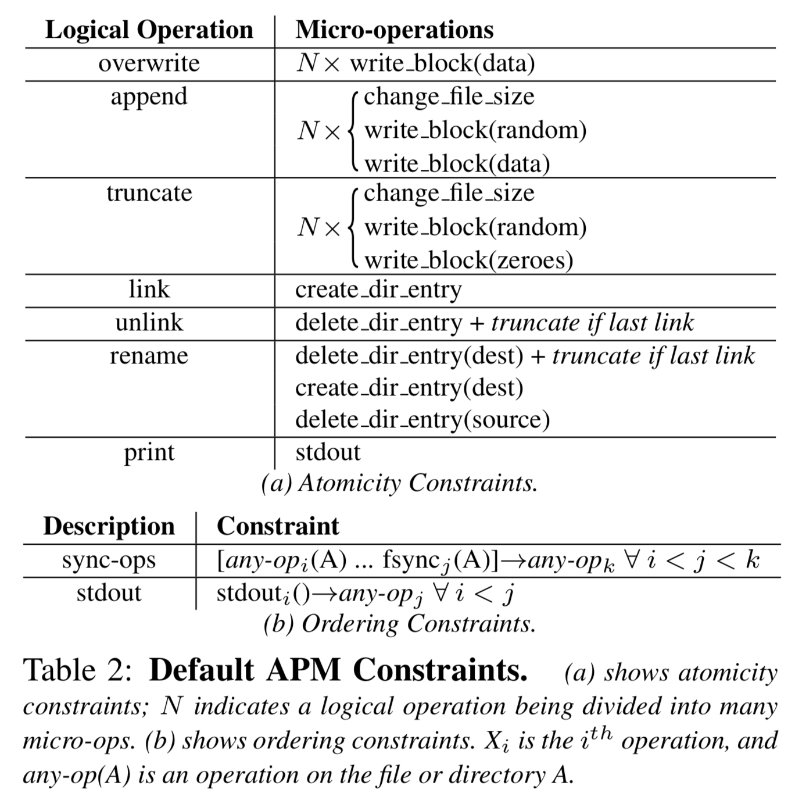

`@Author: Junda Chen`

# CS739 - Week4-2 Note: Alice

All File Systems Are Not Created Equal: On the Complexity of Crafting Crash-Consistent Applications 

Thanumalayan Sankaranarayana, Pillai Vijay Chidambaram, Ramnatthan Alagappan
Samer Al-Kiswany, Andrea C. Arpaci-Dusseau, Remzi H. Arpaci-Dusseau

```
Q5 (due 9/28 @ 11am): Which type of vulnerability uncovered by ALICE is least realistic/important? Which is most important and should be addressed by application developers?

The most/least important vulnerbility is actually judged by the "common sense". If the vulnerability is foresee and commonly avoided by a majority of the developers, they are less important; otherwise, it's important to address.

Least important: Multi-block write sync. Although it might be important in some application, developers are generally awared that when they want multiple blocks to be written, synchronization is not guaranteed.

Most  important: Silent error and Data loss (appearantly). Such errors are not easily fixable, and also hard to trace in real life.


```


# Highlight

**Update protocol**

**Persistence properties**: persist state correlate to subtle behaviors of underlying fs.

**Bob**: Block Order Breaker. Empirical test tool for persistent property among 6 system.

**Alice**: analyze app update protocols and find crash vulnerability among 11 system (including databases, key-value stores, version control systems, distributed systems, and virtualization software)  60 vulnerabilities.


[Alice](https://github.com/madthanu/alice)


Main Questions: 

1. What behaviours of fs relevant to crash-consistent app? => persistent property
   1. Atomicity of operation (does `rename()` atomic?)
   2. Ordering of operation (does fs ensure file creation are persisted in the same order they are issued?)
2. Do modern applications implement crash consistency protocols correctly?

# Detail

## 1. Introduction

**Crash recovery** in database management systems, key-value stores, and file systems.

(? How do you recover from crash? What are the usual ways? Why so difficult?)

**ARIES**: an algorithm for crash recovery


### Two Challenges

#### The first challenge: the exact guarantees provided by file systems are unclear and underspecified.

(? Why using POSIX interface will get a crash-consistent fs?)

> Unfortunately, while the POSIX standard specifies the effect of a system call in memory, specifications of how disk state is mutated in the event of a crash are widely misunderstood and debated [1]. As a result, each file sys tem persists application data slightly differently, leaving developers guessing.


> To add to this complexity, most file systems provide a multitude of configuration options that subtly affect their behavior. 
>
> Linux ext3 provides numerous journaling modes, each with different performance and robustness properties [51].


#### The second challenge: high performance application-level + crash-consistency protocol = not straightforward.


Maintaining will be simple if all state were mutated synchronously.

Hard to:

1. Complex update protocol + High performace
2. Ensure correctness (corner cases: rarely tested, relatively unused, error prone -- dangereous test),

### Main Questions

#### 1.What behaviours of fs relevant to crash-consistent app? => persistent property

1. Atomicity of operation (does `rename()` atomic?)
2. Ordering of operation (does fs ensure file creation are persisted in the same order they are issued?)

**Bob**: Block Order Breaker. 

**Block-level trace**

> BOB collects **block-level traces** underneath a file system and re-orders them to explore possible on-disk crash states that may arise. With this simple approach, BOB can find which persistence properties do not hold for a given system.


> `appendTo(fileA); rename(fileA, "B"); //`
>
> For example, appends to file A are persisted before a later rename of
> file B in the ordered journaling mode of ext3, but not in the same mode of ext4, unless a special option is enabled.


#### 2.Do modern applications implement crash consistency protocols correctly?

**Update protocol**

> no matter how complex the application source code,the update protocol boils down to *a sequence of file-system related system calls.*

**Alice**: Analyzing the permutation of system-call trace of workload.

**Protocol diagrams**: rich annotated graphs of update protocols that abstract away low-level details to clearly present the underlying logic. 


> This behavior varies widely among file sys-
> tems: a number of file-system features such as delayed
> allocation and journaling mode determine whether file
> systems exhibit this behavior. Some common configura-
> tions like ext3 ordered mode persist these operations in
> order, providing a false sense of security to the developer.


(? How to define **the behavior that affects users**?)

> The study focuses on file-system **behavior that affects users,**
> rather than on strictly verifying application correctness.

(? What's the difference between **typical usage scenarios** and **pessimistic view**?)

> We hence consider **typical usage scenarios**, sometimes
> checking for additional consistency guarantees beyond
> those promised in the application documentation.
>
>
>
> Our study takes a pessimistic view of file-system behavior;
> for example, we even consider the case where renames
> are not atomic on a system crash.


**Crash vulnerability**: how the correctness of application depending on fs persistency property.

> In general, if application correctness depends on a specific file system persistence property, we say the application contains a **crash vulnerability**; running the application on a different file system could result in incorrect behavior.


##### Result

**Ordering**: many app implicitly expect ordering. (7/11 trouble from crash)

> We find that many applications implicitly expect **ordering** among system calls (e.g., that writes, even to different files, are persisted in order); when such ordering is not maintained, 7 of the 11 tested applications have trouble properly recovering from a crash. 
>
>
>
> We also find that 10 of the 11 applications expect **atomicity** of file system updates. In some cases, such a requirement is reasonable (e.g., a single 512-byte write or file rename operation are guaranteed to be atomic by many current file systems when running on a hard-disk drive); in other situations (e.g., with file appends), it is less so. 
>
>
>
> We also note that some of **these atomicity assumptions are not future proof**; for example, new storage technology <u>may be atomic only at a smaller granularity than 512-bytes</u> (e.g., eight-byte PCM [12]).
>
>  
>
> Finally, for 7 of the 11 applications, **durability** guarantees users likely expect are not met, often due to <u>directory operations not being flushed.</u>


##### Further Benefit

**Ext3-fast**: retains much of the positive ordering and atomicity properties of ext3 in data journaling mode, <u>without the high cost</u>.


**Ext4:** with delayed allocation, everything goes messy.

> when **delayed allocation** was introduced in Linux ext4, it broke several applications, resulting in bug reports, extensive mailinglist discussions, widespread data loss, and finally, filesystem changes [14].

**Design with foreseeable change**: Testing the impact of changing persistence properties should be part of the fs design process.


## 2. Bob - Block Order Breaker: Persistence Property

> to explore possible on-disk states by re-
> ordering the I/O block stream, and then examine pos-
> sible resulting states.


**Size-atomicity**

> If the append is not atomic, for example, it would
> be possible for the size of the file to be updated without
> the new data reflected to disk; in this case, the files could
> contain garbage, as shown in State A in the diagram. 

**Content-atomicity**

> A lack of atomicity could
> also be realized with only part of a write reaching disk, as
> shown in State B. We refer to this as content-atomicity.


That's why we have ext3-fast ?

> data journaling mode of ext3 provides the highest level of
> consistency, but often results in poor performance [35].


### Bob's workflow

1. Stress the persistence property
2. Collect Block I/O
3. Reorder collected blocks
4. Selectively write some to disk to generate new legal disk state
5. Run fs recovery and check property

> BOB first runs a simple usersupplied workload designed to stress the persistence
> property tested (e.g., a number of writes of a specific size to test overwrite atomicity). BOB collects the block I/O generated by the workload, and then re-orders the collected blocks, selectively writing some of them to disk to generate a new legal disk state (disk barriers are obeyed).
> In this manner, BOB generates a number of unique disk images corresponding to possible on-disk states after a system crash. BOB then runs file-system recovery on each resulting disk image, and checks whether various persistence properties hold (e.g., if writes were atomic).
> If BOB finds even a single disk image where the checker fails, then we know that the property does not hold on the file system. 
>
> Proving the converse (that a property holds in all situations) is not possible using BOB; currently, only simple block re-orderings and all prefixes of the block trace are tested.


**Operation**: system calls that leads to the same fs output.

1. File overwrite
2. File append
3. Directory operations (including `rename`, `link`, `unlink`, `mkdir`, etc.)


### Result

1. Atomicity
   1. Single Sector   ( > some only provide byte atomicity. Why? < )
   2. Single Block    (File inode & data block)
   3. Multiple blocks (Ordered Journaling)
2. Ordering
   1. Append (special cases: append/rename, O_TRUNC/append)
   2. Dir op


Size and alighment affect atomicity.

> The size and alignment of an overwrite or append affects its atomicity. 
>
> Hence, we show results for single sector, single block, and multi-block overwrite and append operations. 

(??? How do you do that)

> However, most file systems seemingly guaran- tee that some prefix of the data written (e.g., the first 10 
>
> blocks of a larger append) will be appended atomically. 


**Append** is interesting (? and with so many questions)

> The append operation has interesting special cases. 
>
>
>
> [[1]] On file systems with the **delayed allocation feature**, it may be persisted after other operations. 
>
>
>
> [[2]] A special exception to this rule is when **a file is appended, and then renamed.**
>
> Since this idiom is commonly used to atomically update files [14], many file systems recognize it and allocate
> blocks immediately. 
>
>
>
> [[3]] A similar special case is **appending to files that have been opened with O_TRUNC**. Even with delayed allocation, successive appends to the same file are persisted in order. 
>
>
>
> Linux ext2 and btrfs freely reorder directory operations (especially operations on different directories [11]) to increase performance.


## 3. ALICE - The Application-Level Intelligent Crash Explorer


**Remaining Questions**

1. How do current applications update their on-disk structures?
2. What do they assume about the underlying file systems? 
3. Do such update protocols have vulnerabilities?


About **ALICE**

> ALICE associates discovered vulnerabili ties directly with source lines, and targets specific states that are prone to reveal crash vulnerabilities in different source lines. ALICE achieves this by constructing file states directly from the system-call trace of an application workload. The states to be explored and verified can be described purely in terms of system calls: the actual storage stack is not involved. ALICE can also be used to abstractly test the safety of new file systems.


### 3.2.1 Usage

1. Supply files & directories + workload script
2. Run checker upon different crash states (? how do you generate the crash states?)
3. produces a logical representation of the update protocol


**Abstract Persistence Models (APMs)**


### 3.2 Crash States and APMs


#### 3.2.1 Logical Operations


#### 3.2.2 Crash States and APMs

1. Converts the trace of system calls in the application workload to **logical operations**
2. Abstract Persistence Models (APMs)


**Logical Operations**: abstract away details such as current read and write offsets, file descriptors, and transform a large set of system calls and other I/O producing behavior into a small set of file-system operations.


##### Abstract Persistence Models (APM)

APM = a logic of a kind of fs

> The APM specifies atomicity constraints by defining how logical operations are translated into micro-ops. 
>
> The APM specifies ordering constraints by defining which micro-ops can reach the disk before other micro-ops. 


Associated entity: (file inode, file size)


**Micro-operations**:

- **write block**: A write of size block to a file. Two spe- cial arguments to write block are zeroes and random: zeroes indicates the file system initializing a newly allocated block to zero; random indicates an unini- tialized block. Writes beyond the end of a file cause data to be stored without changing file size. 

- **change file size**: Changes the size of a file inode. 

- **create dir entry**: Creates a directory entry in a direc- 

  tory, and associates a file inode or directory with it. 

- **delete dir entry**: Deletes a directory entry. 

- **stdout**: Adds messages to the terminal output. 




**Annotated Update Protocol Example**

```python
open(path="/x2VC") = 10
Micro-ops: None Ordered after: None
pwrite(fd=10, offset=0, size=1024)
Micro-ops: #1 write   block(inode=8, offset=0, size=512) Micro-ops: #2 write   block(inode=8, offset=512, size=512) Ordered after: None
fsync(10)
Micro-ops: None Ordered after: None
pwrite(fd=10, offset=1024, size=1024)
Micro-ops: #3 write block(inode=8, offset=1024, size=512) Micro-ops: #4 write block(inode=8, offset=1536, size=512) Ordered after: #1, #2
link(oldpath="/x2VC", newpath="/file")
Micro-ops: #5 create dir entry(dir=2, entry=‘file’, inode=8) Ordered after: #1, #2
write(fd=1, data="Writes recorded", size=15)
Micro-ops: #6 stdout(”Writes recorded”) Ordered after: #1, #2
```


#### 3.2.3 Constructing crash states

1. Seq apply micro-op
2. Convert mutated entities back to actual file
3. Supply to checker

> A new crash state is constructed by **sequentially applying the micro-ops in a selected set to the initial state** (represented as logical entities). 
>
> **For each crash state, ALICE then converts the logical entities back into actual files, and supplies them to the checker.** The user-supplied checker thus verifies the crash state.


### 3.3 Finding Application Requirements

(??? Ugly writing)

1. Atomicity across System Calls: what groups of syscalls must be atomic
2. System-Call Atomicity: is syscall itself atomic
3. Ordering Dependency among System Calls: does the order of syscalls matter

**Atomicity across System Calls:** a group of system calls might need to be atomic.

Idea: 

> In the sequence of crash states generated in this manner, the first crash state to have an application invariant violated indicates the start of an atomic group. 
>
> The invariant will hold once again in crash states where all the system calls in the atomic group are applied. If ALICE determines that a system call X is part of an atomic group, it does not test whether the protocol is vulnerable to X being persisted out of order, or being partially persisted.


**System-Call Atomicity**: Check whether the system call itself is atomic.

Idea: Crash all previous calls (? individually/collectively)

> ALICE tests this for each system call by **applying all previous system calls to the crash state, and then generating crash states corresponding to different intermediate states of the system call** and checking if application invariants are violated.

Special handling:

- appends: fill blocks with random data

> For **appends**, we introduce intermediate states where **blocks are filled with random data**; this models the update of the size of a file reaching disk before the data has been written.
>
> We split overwrites and appends in two ways: 
>
> ​	1. into block-sized micro-operations, and 
>
> ​	2. into three parts regardless of size. 
>
> *Though not exhaustive*, we have found our exploration of append and write atomicity useful in finding application vulnerabilities.


**Ordering Dependency among System Calls**: A must be done before B.


### 3.4 Static Vulnerabilities

dynamic vulnerability: multiple syscalls associate with dynamic. e.g.:`for i in 1:10 {write();}`

> If each write is required to be atomic for application correctness, ALICE detects that each system call is involved in a vulnerability; we term these as dynamic vulnerabilities.
>
>
>
> However, the cause of all these vulnerabilities is a single source line. ALICE uses stacktrace information to correlate all 10 system calls to the line, and <u>reports it as a single static vulnerability</u>.


### 3.5 Implementation

4000 lines of Python code

Traces memory-mapped writes in addition to system calls 

Optimizations: 

1. Cache crash states and incremently generate crash states.
2. Construct crash states and dispatch checkers
3. Filter out logfiles/unrelatedfiles


### 3.6 Limitations

1. Not detected states by Alice
2. Require user to write application workloads and checkers
3. Has not yet handled file attributes (should be straightforward)

Workload Automation

> We believe **workload automation** is orthogonal to the goal of ALICE, and various model-checking techniques can be used to augment ALICE.


## 4 Application Vulnerabilities

### Questions

1. Whether file-system behavior significantly affects application users
2. Which file-system behaviors are thus important
3. Whether testing using ALICE is worthwhile in general

### Objects to study

> We study 
>
> ​	three key-value stores (LevelDB [20], GDBM [19], LMDB [46]), 
>
> ​	three relational databases (SQLite [43], PostgreSQL [49], HSQLDB [23]), 
>
> ​	two version control systems (Git [26], Mercurial [31]), 
>
> ​	two distributed systems (HDFS [40], ZooKeeper [3]), and 
>
> ​	a virtualization software (VMWare Player [52]). 
>
>
>
> We study two versions of LevelDB (1.10, 1.15), since they vary considerably in their update-protocol implementation.


#### LevelDB, GDBM, LMDB (K-V DB)

**LevelDB**: http://taobaofed.org/blog/2017/07/05/leveldb-analysis/,  http://leveldb.org

> 当读写数据库时，首先纪录读写操作到 Op log 文件中，然后再操作内存数据库，当达到 checkpoint 时，则写入磁盘，同时删除相应的 Op log 文件，后续重新生成新的内存文件和 Op log 文件。


**GDBM**: https://blog.csdn.net/heiyeshuwu/article/details/51519388, 


**LMDB**: [Symas Lightning Memory-Mapped Database (LMDB) Notes](http://wiki.dreamrunner.org/public_html/C-C++/Library-Notes/LMDB.html)


#### SQLite, PostgreSQL, HSQLDB (RelationalDB)

**SQLite**


**PostgreSQL**


**HSQLDB**


#### HDFS, ZooKeeper

**HDFS**


**ZooKeeper**


### 4.1 Workloads and Checkers

**ACID**:

- Atomicity   : 
- Consistency : 
- Isolation   : 
- Durability  : Committed transaction will survive permenantly


### 4.2 Overview


### 4.3 Vulnerabilities Found


### 4.4 Common Patterns


### 4.5 Impact on Current File Systems


### 4.6 Evaluating New File-System Designs


> We design ext3-fast to reflect
> this: fsync() on a file A persists only A, while other
> dirty data and files are still persisted in-order.


> so that synced
> directories, files, and their data, depend only on previous
> syncs and operations necessary for the file to exist (i.e.,
> safe file flush is obeyed).


### 4.7 Discussion


## 5 Related Work


## 6 Conclusion


