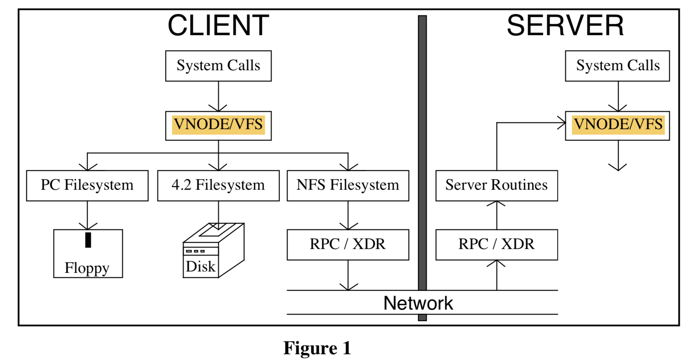

# CS739 Week 5-2 NFS

The Sun Network Filesystem: Design, Implementation and Experience

Russel Sandberg

# Summary

We implement a sync, easy-to-use, easy-to-understand protocol

# Questionsz

**Pre-read questions**

# Details

## Introduction

**Portability**: NFS is designed to be easily portable to other operating systems and machine architectures.

**External Data Representation (XDR)**: describe protocols in a machine and system independent way

**Remote Procedure Call package (RPC)**:simplify protocol definition, implementation, and maintenance.

**Filesystem Interface = VFS + Vnode**
VFS: (on FS) what operation can be done
Vnode: (on file) what operation can be done on file in that fs

> The “filesystem interface” consists of two parts: the **Virtual File System (VFS)** interface defines the operations that can be done on a filesystem, while the **virtual node (vnode) interface** defines the operations that can be done on a file within that filesystem. This new interface allows us to implement and install new filesystems in much the same way as new device drivers are added to the kernel.

## Design Goals

## Basic Design

### NFS Protocol

1. [RPC (Remote procedure call)](https://zh.wikipedia.org/wiki/遠程過程調用): sync, easy to use and understand.
2. stateless protocol: no state maintained for each call procedure, recovery easy (client crash: nothing happen, server crash: no affect last call, just retry)
3. transport independent: ISO and XNS can be plugged in RPC, UDP/IP, ...

**File Handle**: used by client, provided by server, refer to a file, opaque (like file structure on C)

1. New fhandle: lookup, create, mkdir
2. First remote fhandle: **MOUNT** protocol (take dirpath, return fhandle)

MOUNT protocol is the only place that UNIX Pathname are passed to server

> The reason for making this
> a separate protocol is that this makes it easier to plug in new filesystem access checking methods, and it
> separates out the operating system dependent aspects of the protocol. Note that the MOUNT protocol is
> the only place that UNIX pathnames are passed to the server. In other operating system implementations
> the MOUNT protocol can be replaced without having to change the NFS protocol.

XDR: Sun eXtension Data Representation sepecification

> XDR defines the size, byte order and alignment of basic data types such as string, integer, union,  boolean and array. Complex structures can be built from the basic XDR data types. 

1. Easy to use
2. Look like C

### Server Side

1.Must commit any modified data to stable storage before returnning result. (Stateless)

(Example: `write` should return the data block + the modified indirect blocks + the block containin inode)

2.Must add **generation number** in inode, and a **filesystem id** in the superblock.

> These extra numbers make it possible for the server to use the inode number, inode generation number, and filesystem id together as the fhandle for a file. 
>
> The inode generation number is necessary because the server may hand out an fhandle with an inode number of a file that is later removed and the inode reused. 
>
> When the original fhandle comes back, the server must be able to tell that this inode number now refers to a different file. 
>
> The generation number has to be incremented every time the inode is freed.

### Client Side

Binding at MOUNT time: only need to resolve host name once

> Rather than doing a “late binding” of file address, we decided to do the hostname lookup and file address binding once per filesystem by allowing the client to attach a remote filesystem to a directory with the mount command

## The Filesystem Interface

VFS

VNode

MOUNT

`root()`

Each filesystem type must provide mount and mount_root operations to mount normal and root filesystems

> Pathname traversal is done in the kernel by breaking the path into directory components and doing a
> lookup call through the vnode for each component. At first glance it seems like a waste of time to pass
> only one component with each call instead of passing the whole path and receiving back a target vnode.
> The main reason for this is that any component of the path could be a mount point for another filesystem,
> and the mount information is kept above the vnode implementation level. In the NFS filesystem, passing
> whole pathnames would force the server to keep track of all of the mount points of its clients in order to
> determine where to break the pathname and this would violate server statelessness. The inefficiency of
> looking up one component at a time can be alleviated with a cache of directory vnodes.

## Implementation

## Hard Issue

Yellow Page

### Concurrent Access and File Locking

> Because file locking is an inherently stateful service, the lock
> service depends on yet another RPC based service called the status monitor

