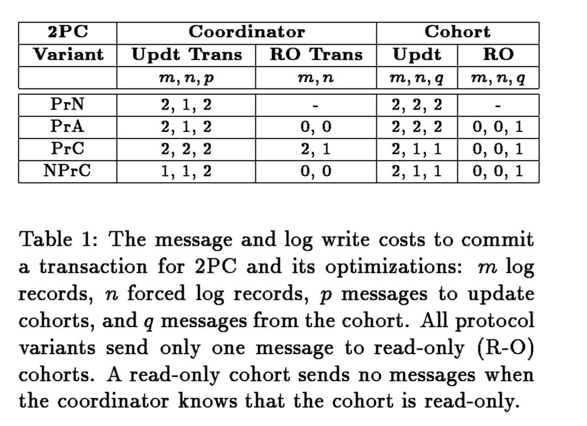

# CS739 Week 7-1: 2pc

A New Presumed Commite Optimization for Two Phase Commit

1993, Butler Lampson and David Lomet

# Summary

Distributed system need consensus, and to know how the commit goes on is a good problem to discuss.. A new form of presumed commit is proposed to both reduce the number of log write and reduce the number of messages to commit, but will have to retain crash-related information.

[TOC]

# Reminder

1. [(Zh) Great Intro to 2PC](https://zhuanlan.zhihu.com/p/21994882)

# Questions

1. What is 2PC? What problem does 2PC solve?
2. What is PrN, PrC, PrA, NPrC? What are the quantitative features in each protocol? 

# Detail

## 1. Introduction

#### @Define: 2PC (Two-phase Commit)

Cssoordinate the commitment of transactions in distributed systems.

**Guarantee the Atomicity of transaction** : all commit or all abort 

#### Cost of 2PC

- **Requires multiple messages in multiple phases.** 
  - Substantial computational cost => affect throughput
  - Substantial delay => affect response time.
- **Requires information about transaction be recorded stably to ensure atomicity at failure.**
  - <u>Force log write</u>: very costly.

## 2. Two Phase Commit

**PrN**: Persumed nothing (actually it make presumptions in some cases [10])

**Optimized 2PC**: make presumption about missing information

### 2.1 The Protocol Messages

**Coordinator**: the coordinator of the operation. A trusted agent.

**Cohort**: the participant of the operation. The generals in Byzantine.

**The Algorithm**

1. <u>Coordinator</u> send `PREPARE` to all cohorts to notify transaction terminated.
2. Each <u>Cohort</u> send a vote message (`COMMIT-VOTE` or `ABORT-VOTE`, indicating to commit/abort the operation) on the outcome of transaction. A cohort responding `COMMIT-VOTE` is prepared.
3. <u>Coordinator</u> send the outcome message (`COMMIT` / `ABORT` ) to every cohort. 
   1. Coordinator will *commit* if all send `COMMIT-VOTE`; 
   2. Coordinator will *aboart* if one send `ABORT-VOTE` or Coordinator time out
4. <u>Cohort</u> terminate transaction accordingly, and send `ACK` to <u>Coordinator</u>.
5. (Optional) <u>Coordinator</u> mark transaction complete.

*The reference to the algorithm step will be denoted as <u>At [N]</u>*

### 2.2 Cohort Activity

<u>Two persistent write (log) for cohort</u>

- AT[2]: a cohort must persist its `prepare` state. (if recover from crash, the cohort can then commit)
- AT[3]: a cohort can ask Coordinator for outcome if it crashes or not received the transaction outcome. *[Blocking aspect of 2PC]*
  - ==Slow network, busy coordinate: how do we deal with it?==
- AT[4]: a cohort must persist `COMMIT` / `ABORT`  outcome before `ACK`. (if recover from crash, the cohort can use the outcome without asking coordinator.) (Usually `ACK` is no urgent to send: it only use for garbage collection)
  - *No urgent to send the `ACK` message*. Can group log write and ACK message (meaning we can ignore the`ACK`, but we should persist the outcome.) ==(why can we do them together? I don't need to consider cases when the cohort is down?)==

### 2.3 The Protocol Database

**Coordinator**: 

- A <u>main memory protocol database</u> that **contains the states of all transactions currently involved**.
  - To Execute the 2PC protocol
  - To Answer transaction outcome: entries of all transactions (committed, aborted, active, registered)
- A log of protocol Database (crash recovery)

**Operation/Data in protocol database**

- Add entry: enters a transaction into its protocol database when the transaction is initiated.
- <u>Transaction Entry</u>: Set of cohort and coordinator's knowledge of their protocol state
  - `entry = (Tid, stable, state, {cid, vote, ack})`
  - `bool isResponded`: cohort sent a `prepare` with a vote
  - `enum vote-type`: `COMMIT-VOTE` or `ABORT-VOTE`
  - `bool isAcked`: cohort `ACK`ed the update of transaction.
  - ...
- Remove cohort: `ACK`ed cohorts can be dropped from the transaction entry.
- Delete entry: all cohorts are responded `ACK` s in a transaction

### 2.4 Coordinator Recovery

#### 2.4.1 Logging for Recovery

**TM**: Transaction manager == coordinator.

`Tid`:  Transaction id

TM logs protocol activities to ensure it can recover the protocol database

- fully ACKed transactions will not be logged.
- PrN logging usually involves 2 log records. How much to log depend on how much you want durability.

**Require**:

- At [3]: Log the outcome before sending the outcome message
- At [4]: Write `non-forced END` to make information durable (`END` == not to restore the transaction entry after crash)

#### 2.4.2 Less Than Full Recovery

- **Presumed nothing**: need to write additional logs, force to reconstruct the table precisely --- including the aborted transaction. But it usually means that**Undecided decision (At [3]) is usually sacrificed to reduce logging cost**. You just retry after the failure of TM.
  - <u>Presumed something</u>: if the transaction is not appeared in the database, the transaction is presummed to be **aborted**. Problems: 
  - <u>Presume nothing</u>: if the transaction is not shown in the database and the cohorts request it, there might be something fishy.

==**Question**: Essentially what problem will the "presumed something" occur?==

Require:

- At [1]: Force to log the entry that init a transaction.
  - At [3] we can Explicitly abort transaction when coordinator crashes before the outcome is *decided*.
- At [4]: Cohorts need to "re-ACK" if the coordinator crashes.

### 2.5 Summary for PrN Protocol

## 3. Presumed Optimization

*(You can skip to the little summary at the end of 3.2)*

**Extend PrN**: PrN assume that *all **not appeared** in the table should be aborted.* 

To those not appeared in the table:

- Make assumption 
- Don't need to log

Summary of this section

### 3.1 Presumed Abort (PrA)

*All entry not in the database is already aborted.* (PrN has some)

**Property**

- Aborted transaction deleted.

**Requirement**

- **All unfinished committed transactions should be properly logged.**

  - At [3]: If transaction abort, delete entry.
  - Before [4]: All committed transactions should properly saved. 
  - After [4]: Delete the committed transaction (no need to make it stable)

  > PrA deletes the protocol database entries for *committed* transactions when 2PC completes. 

==//TODO: Better to show the comparison (within the algorithm) for PrX instead of just showing the table==

### 3.2 Presumed Commit (PrC)

*All entry not in the database is already committed.* 

This one is fundamentally different to PrA!!! Don't be fooled by its symmetry.

**Property**

- All not shown is committed
  - Avoid `ACK`s to save time (especially `ACK`s for aborted transactions)

**Requirement**

- **Must record everything started from prepared to when it committed.**
  - Commit presumption will fail for a transaction lost at any step of the algorithm
- **Must not re-insert committed transaction to the database after failure**
  - Otherwise will be recognized as a mission to abort.
  - Before [4]: Log the not-to-recover message for the committed transaction
  - After [4] (At [5]) (received ACKs for an abort transaction): garbage collect the aborts transactions.

### 3.3 Read-only Optimization

**Read-only Cohort Behavior**

- No logging
- Indifference to transaction outcome
- Release the lock and forget transaction after completion.

**Read-only Optimization**

- Only send one message:  `READ-ONLY-VOTE` to avoid messages, 
- Release the lock and forget transaction after completion

**If all cohorts are read-only, then coordinator can choose whatever they want.**

### 3.4 Advantage of Presumed Abort

## 4. Fewer PrC Log Writes

**Goal: Avoid forcing initiation record**.

1. Give up full knowledge after coordinator crash of the transaction that were active before the crash
2. Give up on garbage collecting the information that we do have about transaction that were active before a crash.

**Approach**

1. Know how coordinator identify transactions that were in the active protocol phase 
2. Know how it manages the protocol database when it cannot garbage collect transaction aborted by crash

**Notation**

| **Term**    | **Explanation**                                              |
| ----------- | ------------------------------------------------------------ |
| $AB$        | Explicitly aborted transaction (stable)                      |
| $COM$       | Explicitly committed transaction (stable)                    |
| $IN$        | Possibly initiated transactions                              |
| $REC$       | Recent Transaction $REC = \{tid | tid_l < tid < tid_h\}$                             |
| $tid_h$     | Last transaction that might have executed (will be higher than $tid_{sta}$) |
| $tid_l$     | A transaction lower than any undocumented active transaction |
| $tid_{sta}$ | Highest tid with a stable log record                         |
| $\Delta$    | Max # of active transaction with tid > tid$_{sta}$           |

### 4.1 Potentially Initiated Transactions

Problem: what may have been active at time of crash?

#### @Define: $IN$

- Must contain all the true active transactions 
- Reduce # of false active transaction
- Can be *Bounded*

#### @Define: Recent Transaction ID 

$tid$ is assigned monotonically increasingly.
$$
REC = \{tid | tid_l < tid < tid_h\} \\
$$

Then we can denote $IN$ for each system crash as the following data structure: 
$$
IN = (tid_l, tid_h, COM \cap REC)
$$
$COM\cap REC$ are the transactions that <u>recently</u> <u>commited</u>. 

**Problems**

1. How to determin $IN$ at recovery time and make sure $tid$s are not reused?
2. How to represent $IN$ compactly? 

### 4.2 Recovering $In$ After a Crash

**Principles**

1. Ensure no $tid$ is reused
2. Ensure all active tid is included

#### 4.2.1 Determining $tid_h$ 

- $\Delta$ Method: extend the upper bound to prevent transaction loss
  - Assign $tid_h = tid_{sta} + \Delta $ where $tid_{sta}$ is the largest tid in log.
- Logging $tid_h$ : log a little higher tid every once a while.

#### 4.2.2 Determining $tid_l$

We should have a tight bound ot $tid_l$ to minimize the spatial cost.

- Not oldest active transaction
  - If commit, force commit record and delete it from protocol database.
  - If aborting, delete after all ACKs have been received.
- Oldest active undocumented transaction: unforce-write new completed/aborting tid

#### 4.2.3 Determining the Set $COM \cap REC$

Need $IN$ to be small since it should be permanently recorded.

- Consecutive $tid$  : consequitively allocated. Bit vector representaation
  - Force $tid_l \rightarrow 0$
  - Force $tid_l + 1 \rightarrow 1$
  - ...
  - Until reaches $tid_{sta}$
- Non-consecutive $tid$  : sparsely allocated. `<Timestamp, nodeid>`
  - 2:1 compression for cardinality around 50 (no more than 500 bytes)

### 4.3 Persistent $IN$ and Its Use

Some transaction in IN are aborted, or not ran. How to detect them and garbage colelct them?

==What here says is that we don't need to care about it.... "easy approaches should suffice"==

## 5. A New PrC Protocol (NPrC)

==//TODO: ADD Later...with more organization. Preferably show the peusdo-algorithm here==

**Feature**

- No force log at protocol start
- No force log to each update for tid and IN set (rely on natural flush)

**Protocol Flow**

1. Coordinator receive `commit` directive.
2. Coordinator send out `PREPARE` to cohorts.
   - No log is forced
3. Cohorts send *message* to coordinator
   1. `ABORT-VOTE`
   2. `COMMIT-VOTE`
   3. `READ-ONLY-VOTE`
4. Coordinator act correspondingly
   1. Received any `ABORT-VOTE` or timed out
      1. <u>Coordinator</u> send all other cohorts who didn't send `ABORT-VOTE` the `ABORT`
      2. <u>Cohorts</u> `ACK` the request
      3. <u>Coordinator</u> delete transaction
         - Crash[1]
      4. <u>Coordinator</u> update $tid_l$ by this tid.
         - Crash[2]
   2. Received at least one `COMMIT-VOTE` and all other `READ-ONLY-VOTE`
      1. <u>Coordinator</u> force a commit log record
         - No need to remember cohorts
         - No need to write END (since no need to expect ACK)
      2. <u>Coordinator</u> delete transaction record, presume it has been commited
      3. If it is the oldest active transaction, <u>Coordinator</u> force a commit record and the new $tid_l$

### 5.1 Coordinator Begins Protocol

- Crash[1]: If the coordinator crash after the deletion of trasaction and $tid_l$ is not yet advanced, the cohorts will acknowledge that the transaction had been aborted.
- Crash[2]: If the coordinator crash after the deletion of trasaction and $tid_l$ is advanced, then the transaction will be ignored as committed.

### 5.2 Aborting Transactions

If the coordinator crash here and $tid_l$ is not yet advanced, $tid$ belongs to $COM$ and will not be in $IN$. 

If the coordinator crash here and $tid_l$ is advanced, the transaction will be aborted since it is in $IN$

### 5.3 Committing Update Transactions

### 5.4 Committing R-O Transactions

### 5.5 Summary and Comparison

## 6. Discussion

### 6.1 Recalcitrant Transactions

### 6.2 Transaction Timestamping

#### 6.2.1 Timestamps for Versioned Data

#### 6.2.2 Timestamps Only for Commit Protocol

### 6.3 Garbage Collecting $IN$

 

