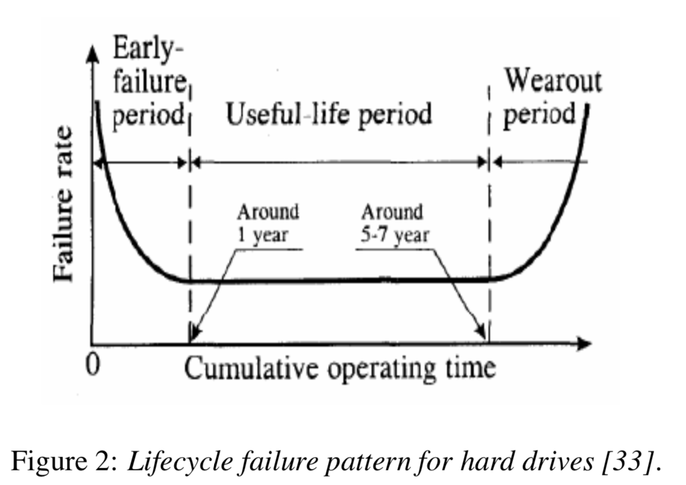

`@Author: Junda Chen`

# CS739 - Week2-1 Note: Diskfail

Disk failures in the real world: What does an MTTF of 1,000,000 hours mean to you?

FAST'07, Bianca Schroeder & Garth A. Gibson

------

# One-line Summary

Seven data sets of storage-related failure about 100k+ drives is studied to provide three aspects: 

- Disk RF vs other hardward's RF
- Quantitative analysis of disk replacement rates
- Statistical properties of disk replacement rates

# CheatSheet

- MTTF (Mean time to Failure) == MTBF (Mean time between failure)
- **datasheet MTTF, datasheet AFR**: what used in the paper. $\neq$ disk failure 
- Annualized failure rate (AFR): measured by accelerated stress test. 
- Reliability: Not do the wrong thing / basic correctness. $\propto \text{MTBF}$
- Availability: System uptime. $=\frac{\text{MTBF}}{\text{MTBF + MTTR}}$
- **Annualized failure rate (AFR)**: the percentage of disk drives in a population that fail in a test scaled to a per year estimation
- **Annual replacement rate (ARR)**: disk replacements that are reported in the customer logs (do not necessarily equal disk failures)

Figure Analysis

- **Figure 1**
- **Figure 7**: Bucket graph - show the Correlations between successive time intervals, indicating a strong relation between week `k` failure and week `k+1` failure, showing that failure is not independent. 

# Question

### Imprtant :fire:

1. What is **Figure 1** talking about

Not important

1. What is figure 10 talking about?

------

# Details

## 1. Introduction

MTTF (Mean time to Failure)

Time between Replacement is not well modeled by an exponential distribution and exibit significant level of correlation

Three Aspects:

- How disk replacement frequencies compare to replacement frequencies of other hardware components.
- Quantitative analysis of disk replacement rates observed in the field and compare our observations with common predictors and models used by vendors
- Statistical properties of disk replacement rates: correlations between disk replacements and identify the key properties of the empirical distribution of time between replacements, and compare our results to common models and assumptions.

## 2 Methodology

### 2.1 What is a disk failure?

Describe the dataset: what is included and what is not. ==//todo==

### 2.2 Specifying disk reliability and failure frequency

**Annualized failure rate (AFR)**: the percentage of disk drives in a population that fail in a test scaled to a per year estimation

**Mean time to failure (MTTF)**: average time to fail.

**datasheet MTTF, datasheet AFR**: what used in the paper. $\neq$ disk failure 

The MTTFs specified for today’s highest quality disks range from 1,000,000 hours to 1,500,000 hours, corresponding to AFRs of 0.58% to 0.88%.

**Annual replacement rate (ARR)**: disk replacements that are reported in the customer logs do not necessarily equal disk failures

### 2.3 Data sources

### :fire: 2.4 Statistical methods

Two metrics:

- Mean $\mu$
- Squared Coefficient of variation $C^2 = \sigma/\mu^2$ :  it is normalized by the mean, and so allows comparison of variability across distributions with different means.

Quantizer:

- Cummulative Distribution Function: fit the followings using maximum likelihood, and evaluate using negative log-likelihood and chi-square test
  - exponential
  - weibull
  - gamma
  - Lognormal 
- Hazard rate of the distribution of time between replacement: $h(t) = f(t)/(1-F(t))$ .  We focus on the hazard rate of the time between disk replacements.
  - A constant hazard rate implies that the probability of failure at a given point in time does not depend on how long it has been since the most recent failure. 
  - An increasing hazard rate means that the probability of a failure increases, if the time since the last failure has been long.
  - A decreasing hazard rate means that the probability of a failure decreases, if the time since the last failure has been long.
- Auto Correlation Function (ACF): measures the correlation of a random variable with itself at different time lags $l$. 
  - e.g.: can be used to determine whether the number of failures in one day is correlated with the number of failures observed $l$ days later.
- ==//TODO: too detailed...== Long-range dependence: measures the memory of a process, in particular how quickly the autocorrelation coefficient decays with growing lags.
  - Hurst exponent: ...

## 3 Comparing disk replacement frequency with that of other hardware components

**Conclusion 1**: (From the data of the replacement of disk) Disk is the among the most frequently replaced component on the machine.

**Conclusion 2**: (From outrage) Third of the major, the first two are CPU and memory. But many problem is fixed by reboot for CPU and memory; for disk, nah.

## 4 Disk replacement rates

### 4.1 Disk replacements and MTTF

#### Figure 1

**Figure 1** shows

- the datasheet AFRs (horizontal solid and dashed line)
- the observed ARRs 
- the weighted average ARR for all disks less than five years old (dotted line).

For HPC1, HPC3, HPC4 and COM3, which cover different types of disks, the graph contains several bars, one for each type of disk, in the left-to-right order of the corresponding top-to-bottom entries in Table 1.

Figure 1 shows **a significant discrepancy between the observed ARR and the datasheet AFR for all data sets**. While the datasheet AFRs are between 0.58% and 0.88%, the observed ARRs range from 0.5% to as high as 13.5%. That is, <u>the observed ARRs by data set and type, are by up to a factor of 15 higher than datasheet AFRs</u>.

**Observation 1: Variance between datasheet MTTF and disk replacement rates in the field was larger than we expected.** The weighted average ARR was 3.4 times larger than 0.88%, corresponding to a datasheet MTTF of 1,000,000 hours. 

**Observation 2: For older systems (5-8 years of age), data sheet MTTFs underestimated replacement rates by as much as a factor of 30.** 

**Observation 3:** Even during the first few years of a system’s lifetime (< 3 years), when wear-out is not expected to be a significant factor, **the difference between datasheet MTTF and observed time to disk replacement was as large as a factor of 6.** 

**Observation 4:** **In our data sets, the replacement rates of SATA disks are not worse than the replacement rates of SCSI or FC disks.** This may indicate that **disk- independent factors**, such as operating conditions, usage and environmental factors, affect replacement rates more than component specific factors. However, the only ev- idence we have of a bad batch of disks was found in a collection of SATA disks experiencing high media error rates. We have too little data on bad batches to estimate the relative frequency of bad batches by type of disk, although there is plenty of anecdotal evidence that bad batches are not unique to SATA disks. 

### 4.2 Age-dependent replacement rates

**Conclusion**: <u>We expect to see Figure 2 - bathtub curve, but instead we see Figure 3,4 - an increasing trend of ARR.</u> 

**Figure 2**: **bathtub curve**: Failure rates of hardware products typically follow a “**bathtub curve**” with high failure rates at the beginning (infant mortality) and the end (wear-out) of the lifecycle

**Goal: How disk replacement rates in large-scale installations vary over a system’s life cycle.**

**Figure 3** shows the annual replacement rates for the disks in the compute nodes of system HPC1 (left), the file system nodes of system HPC1(middle) and the first type of HPC4 drives (right), at a yearly granularity.

**Observation 5 - replacement increase over time.**: Contrary to common and proposed models, hard drive replacement rates do not enter steady state after the first year of operation. Instead **replacement rates seem to steadily increase over time.** 

**Observation 6 - wear-out impact strongly on infant mortality**: Early onset of wear-out seems to have a much stronger impact on lifecycle replacement rates than infant mortality, as experienced by end customers, even when considering only the first three or five years of a system’s lifetime. We therefore recommend that **wear-out be incorporated into new standards for disk drive reliability**. The new standard suggested by IDEMA does not take wear-out into account [5, 33].

## 5 Statistical properties of disk failures 

**Conclusion:** The failure model is not Poisson (independent, time-to-fail obeys exponential). 

### 5.1 The Poisson assumption

**Figure 5 (left)**:  shows the empirical CDF of the number of disk replacements observed per month in the HPC1 dataset, together with the Poisson distribution fit to the data’s observed mean. 

**Figure 5 (right)**: shows the distribution of disk replacements per month, using only data from years 2 and 3 of HPC1. Poisson is better, but still can not say it is Poisson (independent failures and exponential time between failures).

### :fire: 5.2 Correlations

**Correlation**: the failure rate in one time interval is predictive of the failure rate in the following time interval.

#### Figure 7 - Bucket Graph

**Figure 7 show the Correlations between successive time intervals**.

**Figure 7(left)** shows the expected number of disk replacements in a week of HPC1’s lifetime as a function of which bucket the preceding week falls in. **(right)** the one in year 3.

- Define `R(k)` = number of replacement in week $k$.  
- Define `getBucketNum( week k ) -> bucketNumber`
- X-axis: `getBucketNum( R(k) )`. 
- Y-axis: `R(k+1)` = Number of replacement in week R(k)

We assign each week in HPC1’s life to one of three buckets, depending on <u>the number of disk replacements</u> observed during that week, creating a bucket for weeks with small, medium, and large number of replacements, respectively.

The expectation is that a week that follows a week with a “small” number of disk replacements is more likely to see a small number of replacements, than a week that follows a week with a “large” number of replacements. 

#### Figure 6 - Time-lag autocorrelation

**Figure 6 show correlations at different time lags by using the autocorrelation function**. 

**Figure 6 (left)** shows the autocorrelation function for the number of disk replacements per week computed across the HPC1 data set. (If Poisson: should be close to zero). **Figure 6 (right)**, shows the autocorrelation function computed only on the data of the third year of HPC1’s life. Correlation is significant for lags in the range of up to 30 weeks.

**Observation 7**: Disk replacement counts exhibit signifi- cant levels of autocorrelation. 

**Observation 8**: Disk replacement counts exhibit long- range dependence. 

## 5.3 Distribution of time between failure

**Figure 8: TBF is not Exponential, and second failure in RAID can't be assumed exponential **

**Figure 8 (left)** the gamma and Weibull distributions are the best fit to the data, while exponential and lognormal distributions provide a poorer fit. **Figure 8 (right)** shows a close up of the empirical CDF and the distributions matched to it, for small time between replacement values (interesting: key application to estimate the next failure in RAID ). The graph shows that the **exponential distribution greatly underestimates** the probability of a **second failure** during this time period. 

**Figure 9: Exponential cannot even apply in segment of time.**

**Figure 10**: Disk replacement necessarily become around 4 days. Memoriless works, but we're not working on disk 

**Observation 9 - Disk Failure is not Poisson**: The hypothesis that time between disk replacements follows an exponential distribution can be rejected with high confidence. 

**Observation 10 - Disk Failure variate from exponential distribution**: The time between disk replacements has a higher variability than that of an exponential distribution. 

**Observation 11 - the more you stay, the quicker you will be replaced**: The distribution of time between disk replacements exhibits **decreasing hazard rates**, that is, the expected remaining time until the next disk was replaced grows with the time it has been since the last disk replacement. 