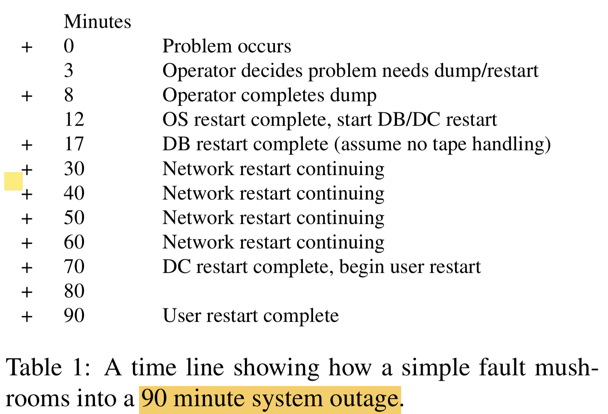
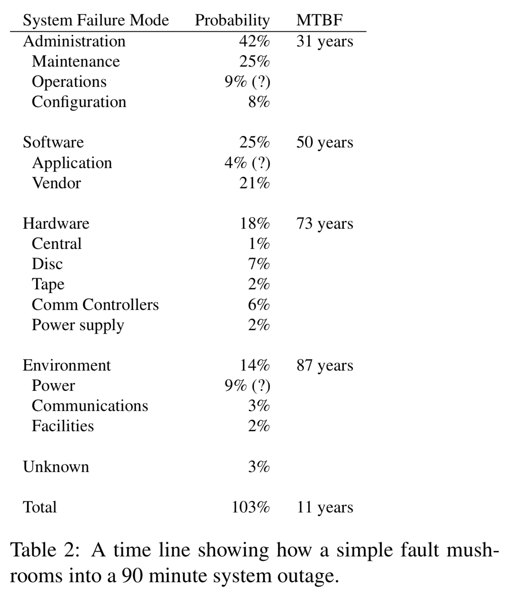

`@Author: Junda Chen`

# CS739 - Week2-1 Note: Gray85

Why Do Computers Stop and What Can Be Done About It?

1985, Jim Gray

# One-line Summary

[TOC]

# CheatSheet

- $\text{Availability} = \frac{\text{MTBF}}{\text{MTBF+MTTR}}$
- $\text{Reliability} \propto \text{MTBF}$

**Raise MTBF**

- Modularity
- Defensive Programming
- Process-pair
- Tolerating Heisenbug

**Bug Type**

- Bohr bug: solid, easily detected bug
- Heisen bug: soft bug, you'll never be able to capture them.

**Summary of Process-pair approach**

- **Lockstep**: primary & backup process synchronously execute the same instruction stream on independent processors. Tolerate hardware fail, but don’t tolerate Heisenbugs, since both process will fail in exactly same say.
- **State Checkpointing**: <u>Communication sessions</u> are used to <u>connect a requester to a process-pair</u>. 
  - **Primary lead**: The primary process in a pair does the computation and sends state changes and reply messages to its backup prior each major event. 
  - **Switch to backup when primary failed**:If the primary process stops, the session switches to the backup process which continues the conversation with the requester. 
  - Session sequence numbers are used to detect duplicate and lost messages, and to resend the reply if a duplicate request arrives.
- **Automatic Checkpointing**: Kernel manage the checkpoint (instead of the primary process manage the checkpoint explicitly). 
  - All messages to and from a a process are saved by the message kernel for the backup process.
  - At takeover, these messages are replayed to the backup to roll it forward to the primary process’ state.
  - When substantial computation or storage is required in the backup, the primary state is copied to the backup so that the message log and replay can be discarded.
- **Delta checkpoints**: <u>Logical updates</u> rather than physical updates are sent to the backup 
  - Logical updates: not message copy, but instruction copy.
- **Persistence** process-pair: Backup wakes up in the null state with amnesia about what was happening at the time of the primary failure. 
  - Only the opening and closing of sessions is checkpointed to the backup.
  - Transaction is a good way to tolerate fault.

**Summary of Process-pair pro/con**

- **Lockstep** processes tolerate hardware fail, but don’t tolerate Heisenbugs. 
- **State checkpoints** give excellent fault-tolerance but are hard to program. 
- **Automatic checkpoints** seem to be inefficient – they send a lot of data to the backup. 
- **Delta checkpoints** have good performance but are hard to program. 
- **Persistent processes** lose state in case of failure, and do not hide failure. But it is the simpliest to program and have low overhead. 

Transactions should have the **ACID** property [Haeder]: 

- **Atomicity**: Either all or none of the actions of the transaction should “happen”. Either it commits or aborts. 
- **Consistency**: Each transaction should see a correct picture of the state, even if concurrent transactions are updating the state. 
- **Integrity**: The transaction should be a correct state transformation. 
- **Durability**: Once a transaction commits, all its effects must be preserved, even if there is a failure. 

**Good models for tolerance**

- (Fault tolerant execution): Transaction + Persistent Process-pairs give fault tolerant execution (but not necessarily availability).
- (Fault tolerant communications) Transactions plus resumable communications sessions give fault-tolerant communications.
- (Fault tolerant storage) Transactions plus data replication give fault tolerant storage.

# Question

---

# Details

## 1 Introduction

We can’t hope’ for better people. 

The only hope is to simplify and reduce human intervention in these aspects of the system.

## 2. Hardware Availability by Modular Redundancy

**Definition**

- $\text{Availability} = \frac{\text{MTBF}}{\text{MTBF+MTTR}}$
- $\text{Reliability} \propto \text{MTBF}$

**Key Idea: Modularity and Redundancy allow system to fail without affecting the availbility of the system as a whole**

- **Modularize** system is the key to high availability
- **Redundancy** leads to small MTTR. The failure is seen as a delay rather than a failure.

Fault-tolerant **hardware** can be generally constructed as follows: 

- Hierarchically decompose the system into modules. 
- Design the modules to have MTBF in excess of a year. 
- Make each module fail-fast – either it does the right thing or stops. 
- Detect module faults promptly by having the module signal failure or by requiring it to periodically send an I AM ALIVE message or reset a watchdog timer. 
- Configure extra modules which can pick up the load of failed modules. Takeover time, including the de- tection of the module failure, should be seconds. This gives an apparent module MTBF measured in millennia. 

(Fault-tolerate software will be mentioned later.)

Table 1: ~~Mushroom is terrible~~ Simple fault halt the whole system.

## 3. An Analysis of Failures of a Fault-Tolerant System

### :fire: Table 2: Analysis of the system

**:fire: Table 2**

1. First, the system MTBF rises from 7.8 years to over 11 years.
   1. **System administration was the main source of failures** – 42%.  (which includes operator actions, system configuration, and system maintenance )
   2. **Software faults were a major source of system outages** – 25% in all.
   3. **The smallest contributor to system outages was hardware**, mostly discs and communications controllers. 

## 4. Implications of the Analysis of MTBF

**Implication 1**: The key to high availability is tolerating operations and software faults.

**Implication 2 (contradictory) **: New and changing systems have higher failure rates; One should install software and hardware fixes as soon as possible. 

- Study shows that only change software when the bug IS causing outrage. Otherwise, wait for the major release and carefully testing it.

**Implication 3**: Software fault-tolerance is important.

> A secondary implication of the statistics is actually a contradiction: 
>
> - New and changing systems have higher failure rates. Infant products contributed one third of all outages. Maintenance caused one third of the remaining out- ages. A way to improve availability is to install proven hardware and software, and then leave it alone. As the adage says, “If it’s not broken, don’t fix it”. 
> - On the other hand, a Tandem study found that a high percentage of outages were caused by “known” hardware or software bugs, which had fixes available, but the fixes were not yet installed in the failing system. This suggests that one should install software and hardware fixes as soon as possible. 
>
> There is a contradiction here: never change it and change it ASAP!

## 5. Fault-tolerant Execution

The keys to this software fault-tolerance are: 

- **Software modularity** through processes and messages. 
- Fault containment through **fail-fast** software modules. 
- **Process-pairs** to tolerate hardware and transient soft- ware faults. 
- **Transaction** mechanism to provide data and message integrity. 
- **Transaction mechanism combined with process- pairs** to ease exception handling and tolerate soft- ware faults. 

- **Persistent process-pairs + Transaction** provide simple execution model which continues execution even when a Heisenbug appears. It also provide high *data availbility* and *execution reliability*, but not necessarily system availability.

### 5.1. Software modularity through processes and messages

**Each module should be a unit of service and a unit of failure.**

- Compiler checker
- Exception handling
- **(simplicity)** Runtime check + Process approach to fault containment

### 5.2. Fault containment through fail-fast software modules

Process approach: Process software module should be fail-fast

**Fail Fast**: Either function correctly, or totally stop working with error message.

### :fire: 5.3. Software faults are soft: the Bohrbug/Heisenbug hypothesis

Software Failure Model

**Bug Type**

- Bohr bug: solid, easily detected bug
- Heisen bug: soft bug, you'll never be able to capture them.

**Experiment**

1. The spooler error log of several dozen systems was examined. 
2. The spooler is constructed as a collection of fail-fast processes. 
3. When one of the processes detects a fault, it stops and lets its brother continue the operation.
4. The brother does a software retry. If the brother also fails, then the bug is a Bohrbug rather than a Heisenbug. 

In the measured period, one out of 132 software faults was a Bohrbug, the remainder were Heisenbugs.

### :fire: 5.4. Process-pairs for fault-tolerant execution

Software failure can be easily tolerated by restart. MTBR = milisec

Why not Process-triple: other component is much worse.

### 5.5. Transactions for data integrity 

Transactions should have the **ACID** property [Haeder]: 

- Atomicity: Either all or none of the actions of the transaction should “happen”. Either it commits or aborts. 
- Consistency: Each transaction should see a correct picture of the state, even if concurrent transactions are updating the state. 
- Integrity: The transaction should be a correct state transformation. 
- Durability: Once a transaction commits, all its ef- fects must be preserved, even if there is a failure. 

The classical implementation of transactions uses **locks** to guarantee consistency and a **log** or *audit trail* to insure atomicity and durability. 

- `BeginTransaction`
- `EndTransaction`
- `AbortTransaction`

### 5.6.  Transactions for fault-tolerant execution 

**Persistent process-pairs + Transaction provide simple execution model which continues execution even when a Heisenbug appears.** 

To *undo* all changes of incomplete transactions:

1.  *abort* all uncommitted transaction
2. restart these transactions.

Transactions provide *reliable execution* and *data availability*, but do not directly provide high system availability.

- > If hardware fails or if there is a software fault, most transaction processing systems stop and go through a system restart – the 90 minute outage described in the introduction.

- Persistent process-pairs leave the network and the database in an unknown state when the backup takes over.

e.g.: Encompass

### 🔥 5.7 Summary of Process-pair approach:

- **Lockstep**: primary & backup process synchronously execute the same instruction stream on independent processors. Tolerate hardware fail, but don’t tolerate Heisenbugs, since both process will fail in exactly same say.
- **State Checkpointing**: <u>Communication sessions</u> are used to <u>connect a requester to a process-pair</u>. 
  - **Primary lead**: The primary process in a pair does the computation and sends state changes and reply messages to its backup prior each major event. 
  - **Switch to backup when primary failed**:If the primary process stops, the session switches to the backup process which continues the conversation with the requester. 
  - Session sequence numbers are used to detect duplicate and lost messages, and to resend the reply if a duplicate request arrives.
- **Automatic Checkpointing**: Kernel manage the checkpoint (instead of the primary process manage the checkpoint explicitly). 
  - All messages to and from a a process are saved by the message kernel for the backup process.
  - At takeover, these messages are replayed to the backup to roll it forward to the primary process’ state.
  - When substantial computation or storage is required in the backup, the primary state is copied to the backup so that the message log and replay can be discarded.
- **Delta checkpoints**: <u>Logical updates</u> rather than physical updates are sent to the backup 
  - Logical updates: not message copy, but instruction copy.
- **Persistence** process-pair: Backup wakes up in the null state with amnesia about what was happening at the time of the primary failure. 
  - Only the opening and closing of sessions is checkpointed to the backup.
  - Transaction is a good way to tolerate fault.
- **Persistent process-pair + Transaction**

### :fire: 5.8 Summary of Process-pair pro/con:

- **Lockstep** processes tolerate hardware fail, but don’t tolerate Heisenbugs. 
- **State checkpoints** give excellent fault-tolerance but are hard to program. 
- **Automatic checkpoints** seem to be inefficient – they send a lot of data to the backup. 
- **Delta checkpoints** have good performance but are hard to program. 
- **Persistent processes** lose state in case of failure, and do not hide failure. But it is the simpliest to program and have low overhead. Persistent process-pairs leave the network and the database in an unknown state when the backup takes over.
- **Persistent process-pair + Transaction**

## 6. Fault-tolerant Communication

Communications lines are the most unreliable part of a distributed computer system.

- Partly because they are so numerous and partly because they have poor MTBF. 
- The operations aspects of managing them, diagnosing failures
  and tracking the repair process are a real headache [Gray]

Tolerate Communication Error:

- At the **hardware** level, fault-tolerant communication is obtained by having **multiple data paths** with independent failure modes. 
- At the **software** level, the concept of **session** is intro- duced. A session has simple semantics: a sequence of messages is sent via the session. 
  - If the communication path fails, an alternate path is tried. 
  - If all paths are lost, the session endpoints are told of the failure.  
  - **Timeout** and **message sequence numbers** are used to detect lost or duplicate messages.
  - **Primary process of session fail**: Session switches to the backup of the process-pair when the primary process fails.
  - **Idempotency**: Session sequence numbers (called SyncIDs by Bartlett) <u>resynchronize the communication state between the sender and receiver</u> and make requests/replies idempotent.
    - if a transaction **aborts**, the session sequence number is logically reset to the sequence number at the beginning of the transaction and all intervening messages are canceled. 
    - If a transaction **commits**, the messages on the session will be reliably delivered EXACTLY once

## 7. Fault-tolerant Storage

**Technique 1: Two different media**, with independent failure characteristics. ==But does that really help? no one knows==

**Technique 2: Remote replication** with independent failure model:

- (Durability): Transaction journal + an archive copy of the data 
- (Atomicity): Transaction

**Technique 3: Geographically Partitioned** among discs/ndoes hence limiting the scope of failure. 

- Better availability [Gray]

## 8. Summary