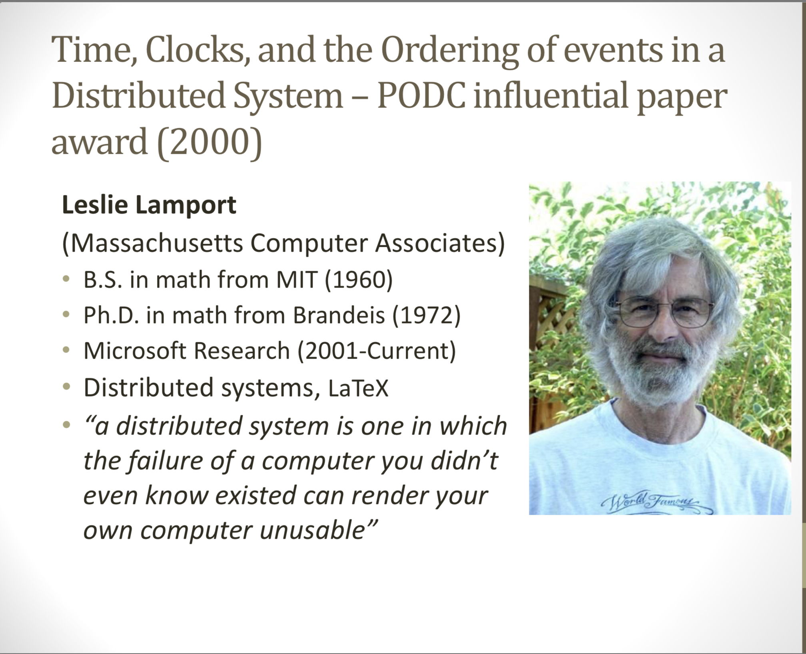

`@Author: Junda Chen`

# CS739 - Week3-1: Clock

Time, Clocks, and the Ordering of Events in a Distributed System 

Leslie Lamport, 1978

---

# Summary

By defining partial relation and a feasible synchronizing algorithm by locally checking timestamp, processes can be synchronized with a system physical clock.

[TOC]

---

# Details

## Introduction

> **Distributed System**: A system is distributed if the message transmission delay is not negligible compared to the time between events in a single process.

### Definition of the distributed system in terms of *clock*.

> In this paper, we discuss the **partial ordering** defined by the "happened before" relation, and give a distributed algorithm for **extending it to a consistent total ordering of all the events.**This algorithm can provide a useful mechanism for implementing a distributed system. We illustrate its use with a simple method for solving syn- chronization problems. 
>
> Unexpected, anomalous behavior can occur if the ordering obtained by this algorithm differs from that perceived by the user.
>
> **This can be avoided by introducing real, physical clocks.** 
>
> We describe a simple method for synchronizing these clocks, and derive an upper bound on how far out of synchrony they can drift. 

### Questions

**1. How to go from Partial order -> full order?**

**2. How to introducint a real, physical clock to synchronize all the components**?

## The Partial Ordering

### Why define event relations using partial order?

> However, if a system is to meet a specification correctly, then that specification must be given in terms of events observable within the system. If the specification is in terms of physical time, then the system must contain real clocks. Even if it does contain real clocks, there is still the problem that such **clocks are not perfectly accurate** and **do not keep precise physical time**.  We will therefore define the "happened before" relation without using physical clocks.

### Process = `{(event, time)}`

> a single process is defined to be **a set of events** with an a **priori total ordering**.

Each event is associated with a time (a number in the fully-ordered set)

### @Define: "happen before"

1. Same process relation
2. Sender and Receipient relation
3. transitive
4. irreflexible

> Another way of viewing the definition is to say that *a --> b* means that it is possible for event a to causally affect event b. 
>
> Two events are **concurrent** if neither can causally affect the other.

(Just for fun) Space-time invariant property

> # This definition will appear quite natural to the reader
>
> familiar with the invariant space-time formulation of
> special relativity, as described for example in [1] or the
> first chapter of [2]. In relativity, the ordering of events is
> defined in terms of messages that could be sent. However,
> we have taken the more pragmatic approach of only
> considering messages that actually are sent. We should
> be able to determine if a system performed correctly by
> knowing only those events which did occur, without
> knowing which events could have occurred.

## Logical Clocks

### @Define: Clock

> A clock is just **a way of assigning a number to an event**, where the number is thought of as the time at which the event occurred.
> The entire system ofclbcks is represented by the function $C$ which assigns to any event $b$ the number $C(b)$, where $C(b) = C_j(b)$ if b is an event in process $P_j$. 
> For now, we make no assumption about the relation of the numbers Ci(a) to physical time, so we can think of the clocks Ci as logical rather than physical clocks.

Notation

> $P_i$ : a process 
> $C_i$ : Clock for a process $P_i$
> $C_i<a>$: Clock that assign a number for any event $a$ in the process.

### Clock Condition: Correctness of the clock

> ​	**For any events a, b:  if a $\rightarrow$ b then $C(a) < C(b)$.**
>
> (if an event a occurs before another event b, then a should happen at an earlier time than b.)

> C1. If a and b are events in process P~, and a comes before b, then Ci(a) < Ci(b). 
>
> C2. If a is the sending of a message by process Pi and b is the receipt of that message by process Pi, then Ci(a) < Ci(b). 

Space-time Digram 

> Condition C1 means that there must be a tick line between any two events on a process line, and
>
> Condition C2 means that every message line must cross a tick line. 

(Common knowledge)

> Without introducing the concept of physical time into the system (which requires introducing physical clocks), there is no way to decide which of these pictures is a better representation.

**System clocks to satisfy the Clock Condition**

1. IR1: Each process $P_i$ increments Ci between any two successive events.
2. IR2: $C_j(now)$ > $C_j(prev)$ $T_m = C_i(a)$ time stamp of send. 

## Ordering the Events Totally

> The ordering $\Rightarrow$ depends upon the system of clocks $C_i$, and is <u>not unique</u>. ... It is only the partial order that is uniquely defined by the systems of events.

The total order exist, but there is no unique total order.

**So how shall we choose a total order?**

### Case Analysis: Mutual Exclusion Problem

#### Problem Formulation

> Consider a system composed of a fixed collection of processes which share a single resource. Only one process can use the resource at a time, so the processes must synchronize themselves to avoid conflict. We wish to find an algorithm for granting the resource to a process which satisfies the following three conditions: 
>
> - (I) A process which has been granted the resource must release it before it can be granted to another process.
> - (II) Different requests for the resource must be granted in the order in which they are made. 
> - (III) If every process which is granted the resource eventually releases it, then every request is eventually granted.
>
> (We assume that the resource is initially granted to exactly one process.)
>
> Condition II says nothing about which of two concurrently issued *requests* should be granted first.

#### Solution Algorithm

> The algorithm is then defined by the following five rules. For convenience, the actions defined by each rule are assumed to form a single event.
>
> **Request**
>
> \1. To request the resource, process Pi sends the mes- sage TIn:P/requests resource to every other process, and puts that message on its request queue, where T,~ is the timestamp of the message. 
>
> \2. When process Pj receives the message T,~:P~ re- quests resource, it places it on its request queue and sends a (timestamped) acknowledgment message to P~.'~ 
>
> **Release**
>
> \3. To release the resource, process P~ removes any Tm:Pi requests resource message from its request queue and sends a (timestamped) Pi releases resource message to every other process. 
>
> \4. When process Pj receives a Pi releases resource message, it removes any Tm:P~requests resource message from its request queue. 
>
> **Grant check**
>
> \5. Process P/is granted the resource when the follow- ing two conditions are satisfied: (i) There is a Tm:Pi requests resource message in its request queue which is ordered before any other request in its queue by the relation ~. (To define the relation "~" for messages, we identify a message with the event of sending it.) (ii) P~has received a message from every other process time- stamped later than Tin.~
> 

> This is a distributed algorithm. Each process independently follows these rules, and there is no central synchronizing process or central storage.

**State machine**: $e:C \times S \rightarrow S$

**request command, release command**

#### Problem: when a process crash

see [ref3](http://citeseerx.ist.psu.edu/viewdoc/download?doi=10.1.1.299.8315&rep=rep1&type=pdf)

## Anomalous Behavior

> The first way is to explicitly introduce into the system the necessary information about the ordering

### Strong Clock Condition. 

For any events a, b in set F: if a -> b then C(a} < C(b).

Now I'm convinced of this man.

> One of the mysteries
> of the universe is that it is possible to construct a system
> of physical clocks which, running quite independently of
> one another, will satisfy the Strong Clock Condition. We
> can therefore use physical clocks to eliminate anomalous
> behavior.

## Physical Clocks

PC1: Clocks are ticked with stable gaps.

PC2: Clocks are greatly synchronized **<= hard to hold!**

Notation

> $\kappa$: Clock tick drift upper bound.
>
> $\epsilon$: a small time needed to be satisfied between two clocks' drift.
>
> $v_m = t' - t$: total delay of message $m$
>
> $\mu_m \leq v_m$: minimum delay (that the system knows)
>
> $ ? = v_m - \mu_m$: unpredictable delay.

### Physical Clock Rule

IR1. 

For each i, if Pi does not receive a message at physical time t, then C/is differentiable at t and $dCg(t)/dt >0$. 

IR2

(a) If Pg sends a message m at physical time t, then m contains a timestamp Tm= C/(t). 

(b) Upon receiving a message m at time t', process P/ sets C/(t') equal to maximum (Cj(t' - 0), Tm + /Zm).9 

Notation

> $\tau$: sent over this arc every $\tau$ second-- Pi send Pj at least one message between $t$ and $t+\tau$ . 
>
> $d$: diameter of the directed graph -- maximum path arcs from Pi to Pj.

[4] Dissemination of system-time. 1EEE Trans. Comm. Com-23, 5 (May 1973), 605-624.

## Conclusion

Appendix: Proof of the Theorem

# Side Note

1. About Lamport

