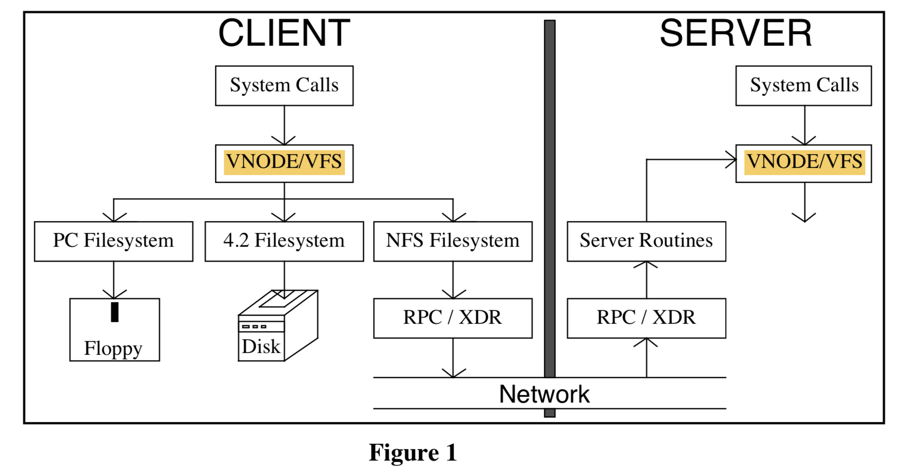

`@author: Junda Chen`

# CS739 Week 5-2 NFS

The Sun Network Filesystem: Design, Implementation and Experience

Russel Sandberg

# Summary

Sun implement NFS -- a sync, easy-to-use, easy-to-understand protocol for then-Distributed-system (distributed file storage).

By maintaining portability, using XDR, RPC, and designing filesystem interface VFS + VNode, NFS is able to achieve a good speed (at that time) compared to the other fs, and comparable to local file operations.

[TOC]

# Reminder

1. Distinguish between File Handle, File Descriptor and File Metadata (structure? ==Let me figure that out...==).
2. It's good to look at the protocols listed in the paper.

# Questions

**Pre-read questions**

1. What is NFS? What is the purpose of designing a FS like NFS?

# Details

## Introduction

### Design Corner-stone

- **Portability**: NFS is designed to be easily portable to other operating systems and machine architectures.
- **External Data Representation (XDR)**: describe protocols in a machine and system independent way
- **Remote Procedure Call package (RPC)**:simplify protocol definition, implementation, and maintenance.
- **Filesystem Interface = VFS + Vnode**
  `vfs`: (on FS) what operation can be done
  `vnode`: (on file) what operation can be done on file in that fs

> The “filesystem interface” consists of two parts: the **Virtual File System (VFS)** interface defines the operations that can be done on a filesystem, while the **virtual node (vnode) interface** defines the operations that can be done on a file within that filesystem. This new interface allows us to implement and install new filesystems in much the same way as new device drivers are added to the kernel.

## Design Goals

- **Machine and Operating System Independence**
- **Crash Recovery**: client & server can easily recover from crashs & network problem
- **Transparent Access**: access remote file just like local ones
- **UNIX Semantics Maintained on UNIX Client**: for transparent purpose
- **Reasonable Performance**: comparable to local disk access

## Basic Design

Three easy pieces:

- Protocol
- Server
- Client

### NFS Protocol

1. [**RPC (Remote procedure call)**](https://zh.wikipedia.org/wiki/遠程過程調用): sync, easy to use and understand.
2. **Stateless protocol**: no state maintained for each call procedure, recovery easy (client crash: nothing happen, server crash: no affect last call, just retry)
3. **Transport independent**: can use different kinds of network transport protocol (ISO and XNS can be plugged in RPC, UDP/IP, ...)

**File Handle** (not to confused by *File Descriptor*): like a `file stat structure` used by client, provided by server, refer to a file, opaque

1. New fhandle: `lookup`, `create`, `mkdir`
2. First remote fhandle: **MOUNT** protocol (take dirpath, return fhandle)

*: In most cases client need to pass the file handle to the server to operate on the file. One only exception is the <u>mount of the device</u>. <u>MOUNT</u> protocol is the only place that requires a UNIX Pathname passing to server. 

> The reason for making this a separate protocol is that this makes it easier to plug in new filesystem access checking methods, and it separates out the operating system dependent aspects of the protocol. 
>
> Note that the MOUNT protocol is the only place that UNIX pathnames are passed to the server. In other operating system implementations the MOUNT protocol can be replaced without having to change the NFS protocol.

[**XDR**](https://tools.ietf.org/html/rfc4506): Sun e**X**tension **D**ata **R**epresentation sepecification

> XDR defines the <u>size</u>, <u>byte order</u> and <u>alignment</u> of basic data types such as <u>string, integer, union,  boolean and array</u>. Complex structures can be built from the basic XDR data types. 

1. Look like C
2. Use like C

**Protocol outline**:(see p2-3 of the paper)

### Server Side

1.**Must commit any modified data** to stable storage before returnning result. (Stateless)

(Example: `write` should return the data block + the modified indirect blocks + the block containing inode)

2.Must add **generation number** in inode, and a **filesystem id** in the superblock.

> These extra numbers make it possible for the server to use the inode number, inode generation number, and filesystem id together as the fhandle for a file. 
>
> The inode generation number is necessary because the server may hand out an fhandle with an inode number of a file that is later removed and the inode reused. 
>
> When the original fhandle comes back, the server must be able to tell that this inode number now refers to a different file. 
>
> The generation number has to be incremented every time the inode is freed.

### Client Side

Binding at MOUNT time: only need to resolve host name once

> Rather than doing a “late binding” of file address, we decided to do the hostname lookup and file address binding once per filesystem by allowing the client to attach a remote filesystem to a directory with the mount command

## The Filesystem Interface

VFS

VNode

MOUNT

`root()`

Each filesystem type must provide mount and mount_root operations to mount normal and root filesystems

> Pathname traversal is done in the kernel by breaking the path into directory components and doing a
> lookup call through the vnode for each component. At first glance it seems like a waste of time to pass
> only one component with each call instead of passing the whole path and receiving back a target vnode.
> The main reason for this is that any component of the path could be a mount point for another filesystem,
> and the mount information is kept above the vnode implementation level. In the NFS filesystem, passing
> whole pathnames would force the server to keep track of all of the mount points of its clients in order to
> determine where to break the pathname and this would violate server statelessness. The inefficiency of
> looking up one component at a time can be alleviated with a cache of directory vnodes.

## Implementation

Stories about how NFS is implemented. Skip

## Hard Issue

### Credentials, Authentication and Security

Mapping from uid and gid to user must be the same on the server and client.

Yellow Page

### Concurrent Access and File Locking

> Because file locking is an inherently stateful service, the lock
> service depends on yet another RPC based service called the status monitor
>

### UNIX Open File Semantics

**Problem1. UNIX allow removal of an open file.**

> This is a disgusting bit of UNIX trivia and at first we were just not going to support it, but it turns out that all of the programs that we didn’t want to have to fix (csh, sendmail, etc.) use this for temporary files.

**Solution1. `rename` the file (to make a sort-of invisible illution) instead of really `remove` the file.** It's a 3/4 solution becuase if the client crashes between `rename` and `remove`, a garbage file will remain on the client disk.

**Problem2. Access permission can change while the file is open**.

> In the local case the access permission is only checked when the file is opened, but in the remote case permission is checked on every NFS call. 
>
> This means that if a client program opens a file, then changes the permission bits so that it no longer has read permission, a subsequent read request will fail. 

**Solution2. Save the client credentials in the file table at open time, and use them in later file access requests.**

### Time Skew

We will fix it later.

==//TODO: when and where did they fixed it ..?==

## Performance

==//TODO: will add soon...==

# SideNote

1. More about NFS history: https://en.wikipedia.org/wiki/Network_File_System
2. More about NFSv4: https://tools.ietf.org/html/rfc3530
3. More about NFS src code: https://www.ibm.com/developerworks/cn/linux/l-cn-nfs/index.html
4. The following paper of this NFS [paper](http://citeseerx.ist.psu.edu/viewdoc/download;jsessionid=115B16A81CBC0856B27D8B6F4C361321?doi=10.1.1.14.473&rep=rep1&type=pdf) 